# Architecture Diagrams - Threads of Thought Blog

## 1. C4 Model Diagrams

### Level 1: System Context Diagram

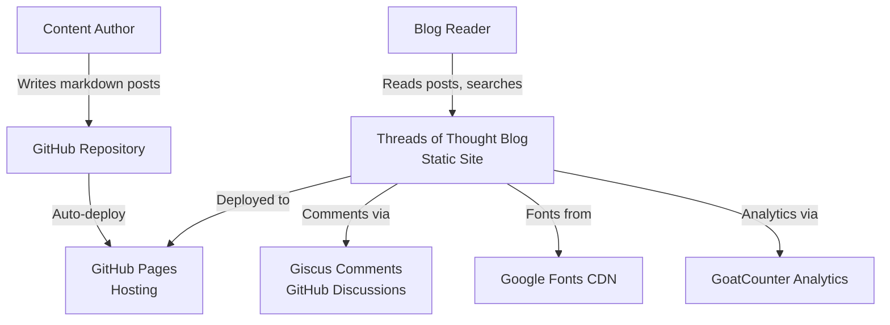

### Level 2: Container Diagram

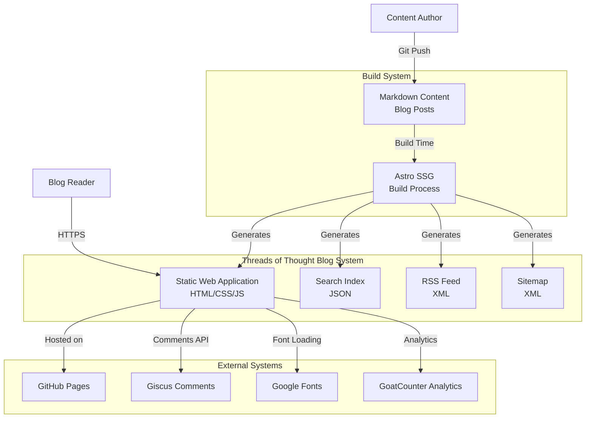

### Level 3: Component Diagram

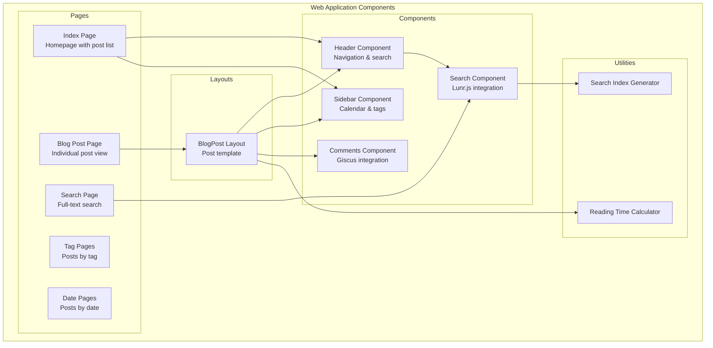

## 2. System Context Diagram

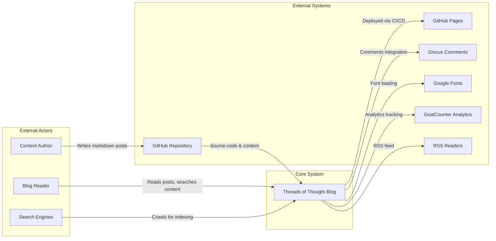

## 3. Data Flow Diagram

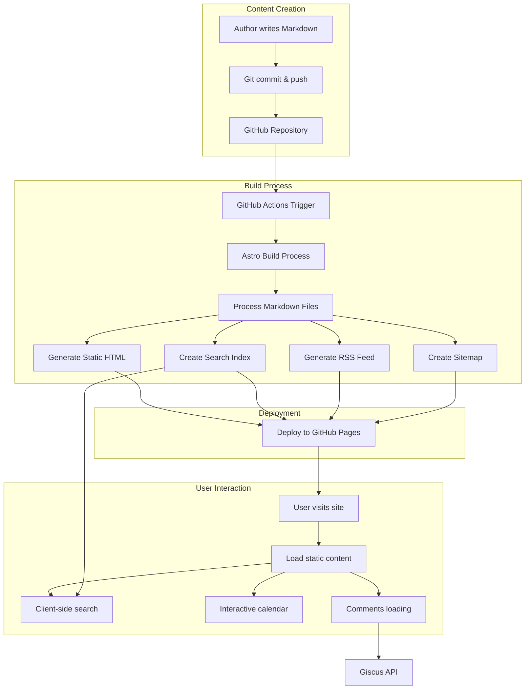

## 4. Component Architecture Diagram

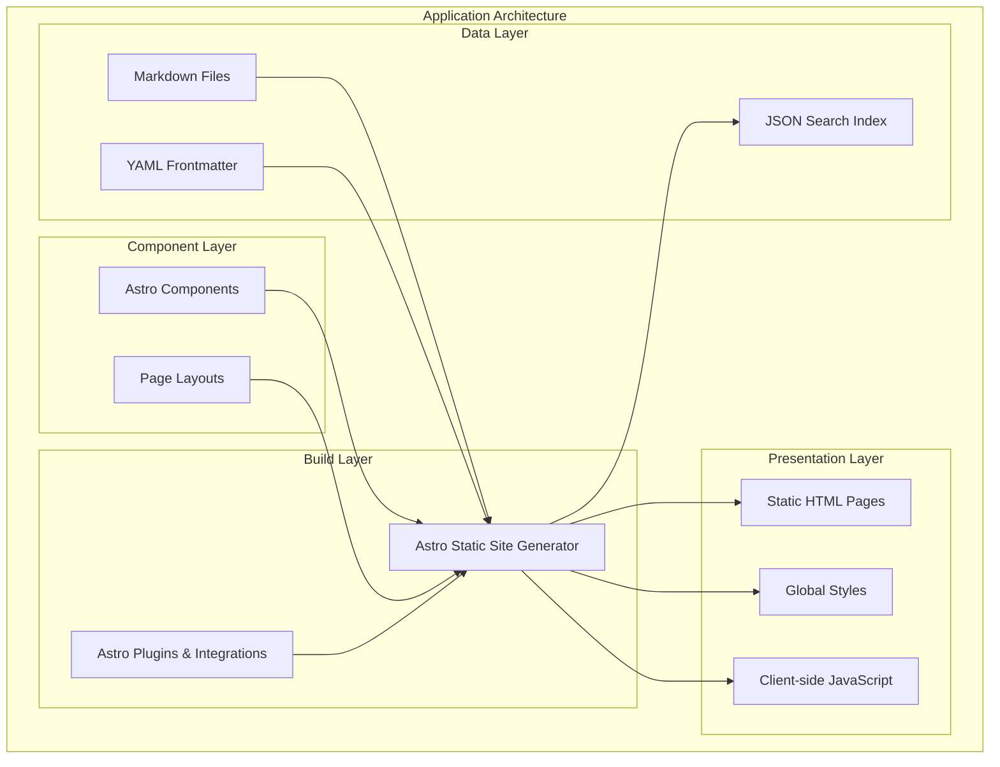

## 5. Technology Stack Visualization

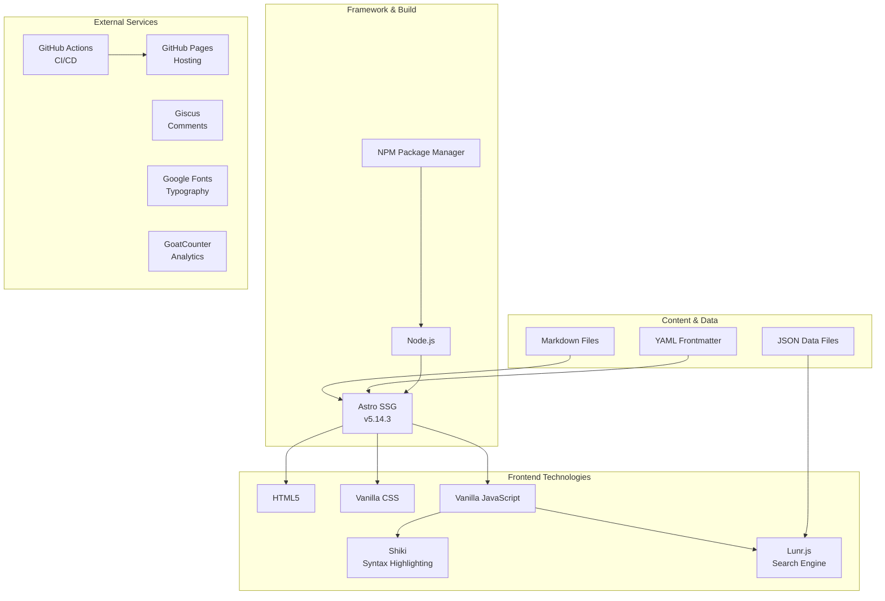

## 6. Feature-Based Architecture Diagrams

### Search System Architecture

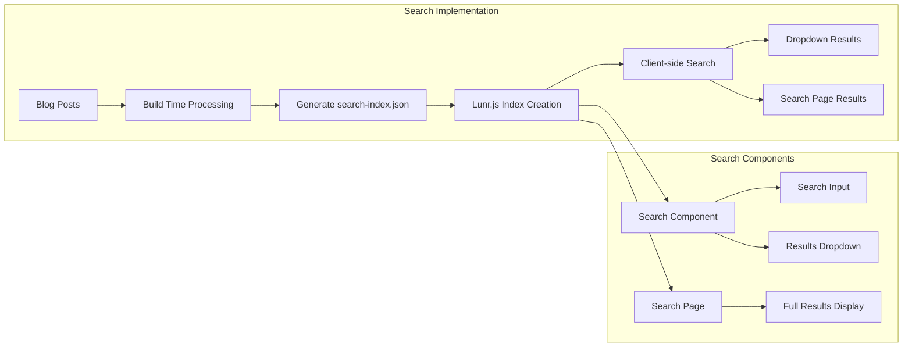

### Calendar System Architecture

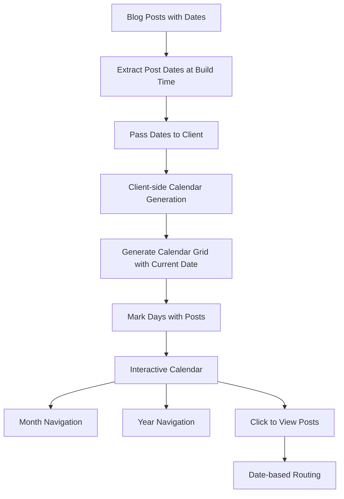

### Comments System Architecture

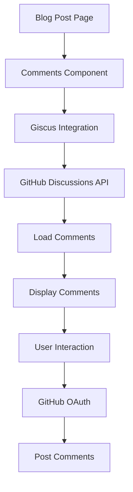

## 7. Deployment Pipeline Diagram

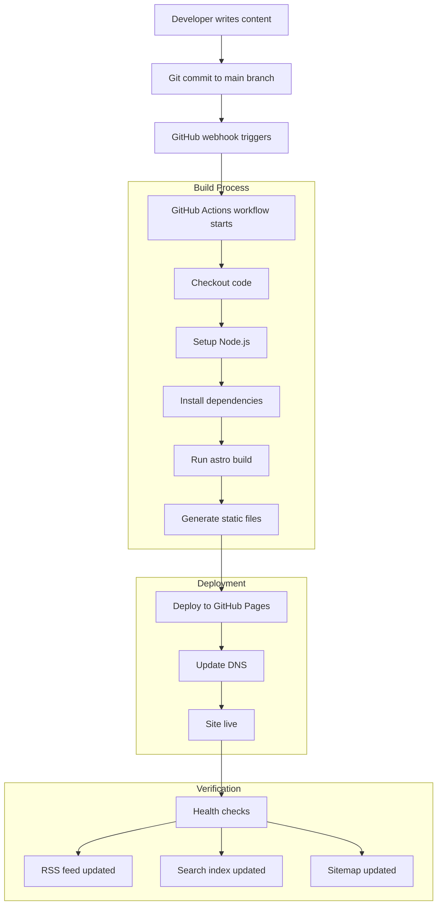

## 8. Security & Performance Architecture

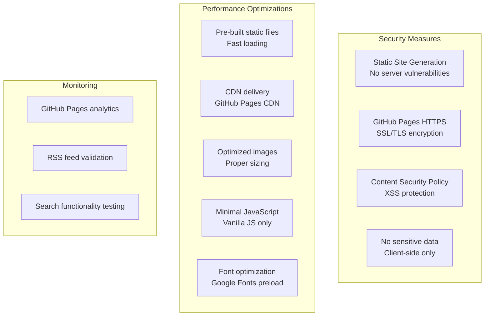

## Usage Notes

- **C4 Model**: Shows system at different abstraction levels
- **System Context**: External dependencies and actors
- **Data Flow**: How content moves through the system
- **Component Architecture**: Internal structure and relationships
- **Technology Stack**: All technologies used in layers
- **Feature Diagrams**: Specific functionality implementations
- **Deployment Pipeline**: CI/CD process flow
- **Security/Performance**: Non-functional requirements

These diagrams can be rendered using Mermaid in any Markdown viewer or documentation platform.