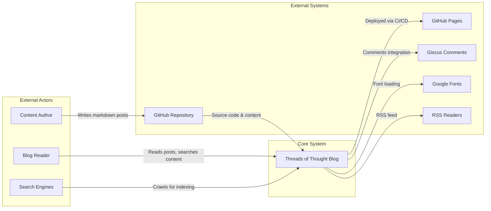
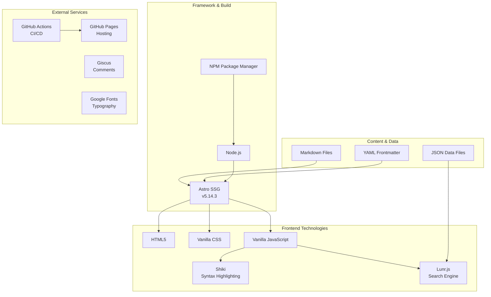
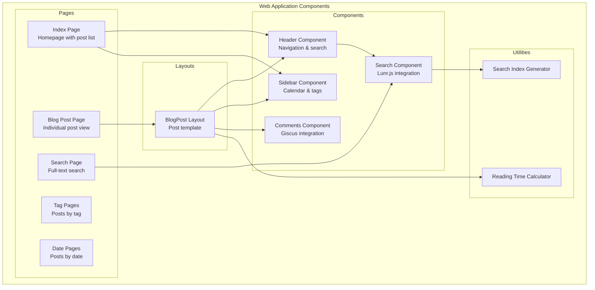
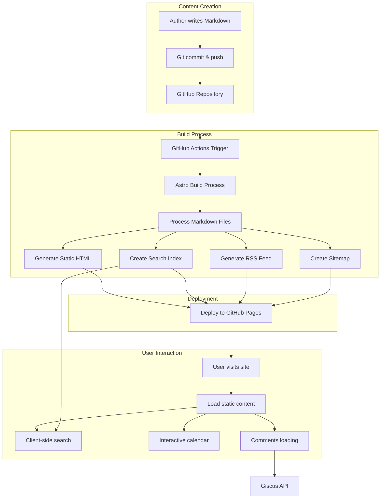
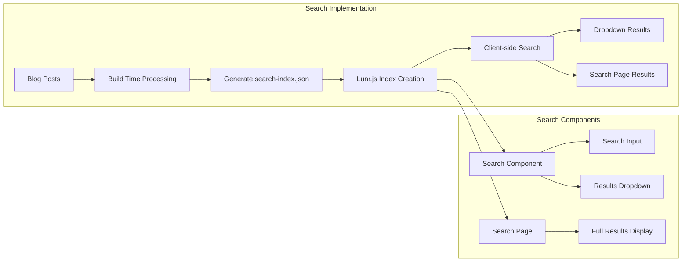
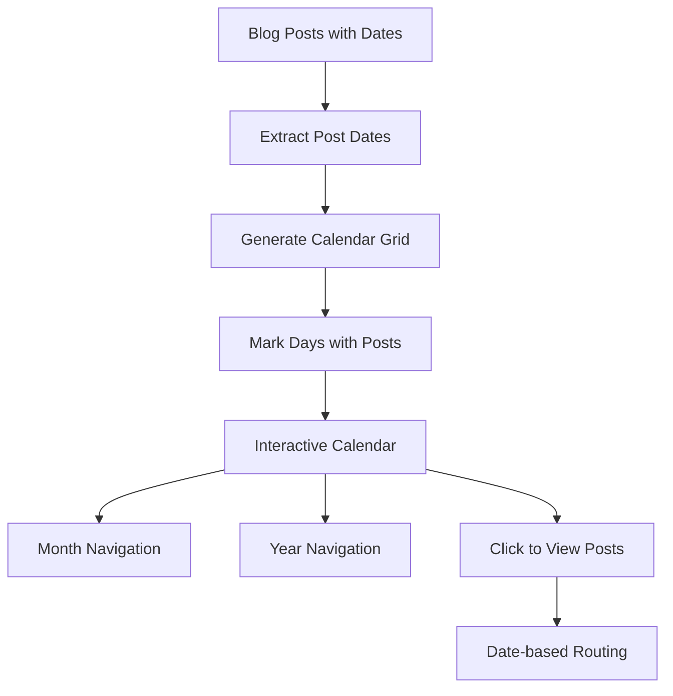
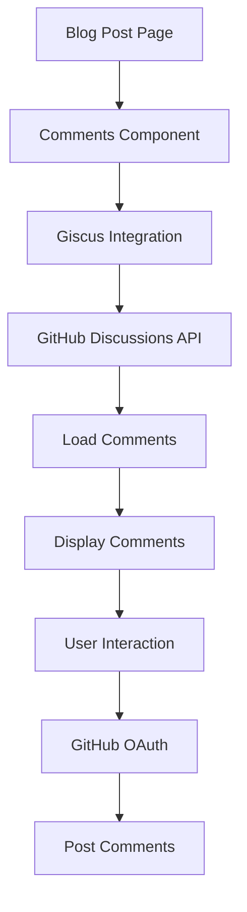
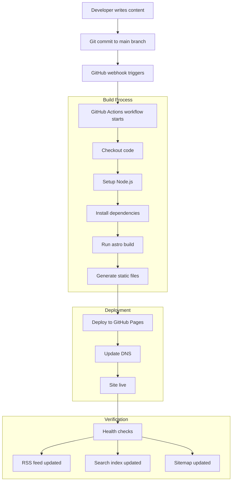
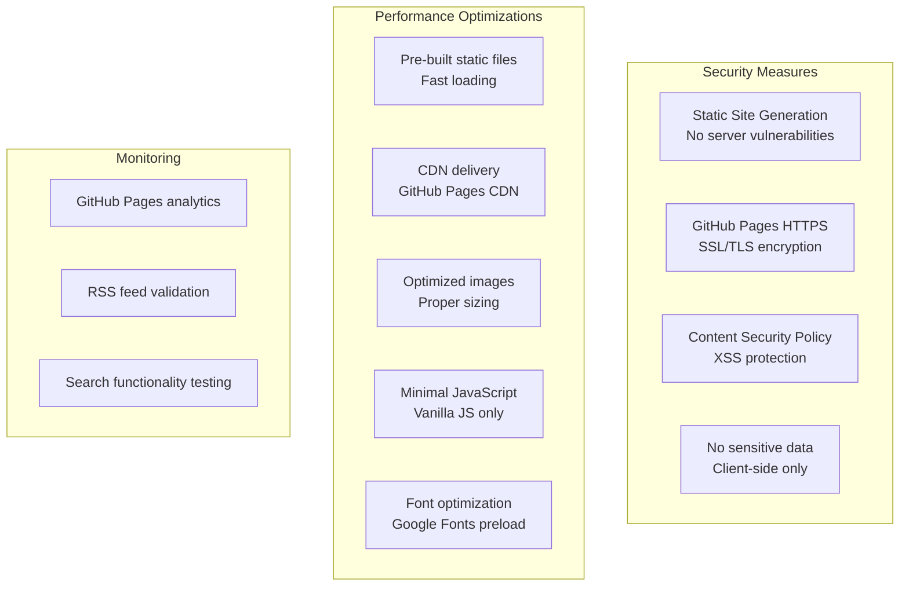

I tried a few blogging platforms before building this one. I started with Hashnode, but it feels like the project isn't really maintained anymore. When I tried sharing posts, they wouldn't fetch proper SEO data, which was pretty annoying. Medium's markdown support is just... not great. Also considered dev.to but I'm not a fan of the interface, plus the overall quality of posts there isn't really my vibe (not that mine are masterpieces, but you know what I mean).
I'm actually not sure if I want to keep going here but just wanted to build something.
So I built this one with Astro. Here's how it works and why I made these choices.

## System Overview

Let's start with the big picture, how this blog fits into the broader ecosystem:

## Why Static Site Generation?

The biggest decision was going with **Static Site Generation (SSG)** instead of a traditional server or single-page app.

### Why SSG?

**Performance Benefits:**

- Pre-built HTML files serve instantly from CDN (content delivery network - basically copies of your site stored worldwide for faster access)
- No server processing time (pages don't need to be generated on-demand)
- Minimal JavaScript payload (less code to download)
- Excellent Core Web Vitals scores (Google's performance metrics)

**Security Advantages:**

- No server-side attack surface
- No database vulnerabilities
- Content is immutable once deployed

**Cost Efficiency:**

- Free hosting on GitHub Pages
- No server maintenance
- Scales automatically with CDN (content gets served from servers close to your users)

**Trade-offs:**

- Build time increases with content volume
- Dynamic features require client-side implementation
- Content updates need full rebuilds

## Technology Stack Architecture

### Why Astro?

I actually discovered Astro when I saw another blog mention it was "Built with Astro" in the footer. The site was fast and clean, so I decided to check it out. After looking at a bunch of options, I settled on Astro:

**What I liked about Astro:**

- Zero JavaScript by default, pages are just HTML unless you add JS
- You can use any framework you want (React, Vue, Svelte) or none at all
- Fast builds and great performance
- Simple to get started, no complex configuration needed

**vs Next.js:**

- Way simpler for static content (no getStaticProps/getStaticPaths boilerplate for every page)
- Better performance for blogs (Next.js ships React runtime even for static content)
- Less configuration overhead (Next.js has tons of options for rendering modes, caching, etc.)

**vs Gatsby:**

- Builds are actually fast (Gatsby's builds can take forever with lots of content)
- No GraphQL layer to learn (Gatsby forces you to query everything through GraphQL, even simple data)
- Simpler mental model (no complex plugin ecosystem to navigate)

**vs Hugo:**

- I know Go much better than JavaScript, but for front-end templating I'm more familiar with JavaScript patterns than Go templates (even though I'd probably pick up Hugo's templating quickly)
- Astro's component syntax feels more familiar coming from a programming background
- Better integration with modern JavaScript libraries and tools

**Trade-offs:**

- Smaller ecosystem than Next.js
- Less mature than Hugo
- Learning curve for Astro-specific concepts (frontmatter separation, file-based routing, static path generation)

## Component Architecture

### How I Organized Things

**Reusable Stuff:**

- Header and Sidebar everywhere for consistency
- Search functionality shared across pages
- One BlogPost layout for all

**Utilities:**

- Reading time calculator (I really appreciate when this is at the top of any post I read)
- Search index generator (learned something by developing the blog, I had no idea you can do search without something like Elasticsearch... back-end dev problems)
- Keeping shared logic in one place

## Data Flow Architecture

### The Content Pipeline

**Markdown Everything:**

- All posts are just Markdown files
- YAML frontmatter for the metadata
- Everything lives in Git

**Why this works:**

- I can write in any editor I want
- Content isn't locked to any platform
- Easy to backup (it's just files!)
- Code blocks and formatting just work

**The build process:**

- Astro processes everything at build time
- Search index gets generated automatically
- RSS feed updates itself
- Sitemap gets created for SEO

**The downside:**

- No real-time updates (need to rebuild)
- Can't do fancy dynamic stuff easily (but I also don't do fancy so...)

## Feature Architecture Deep Dives

### Search System

**Search Decisions:**

**Client-side with Lunr.js:**

- No server needed
- Search is instant
- Works even offline

**The trade-offs:**

- Users download the search index (more bandwidth)
- Won't scale to huge sites (but I also will not write that much)
- No search analytics
- Pretty basic ranking

**Free alternatives I considered:**

- Basic text search: Too clunky (just matching exact words, no ranking, poor user experience)
- Simple grep-style filtering: Works but feels broken compared to real search

### Calendar System

**Calendar Decisions:**

**Made it interactive:**

- JavaScript calendar with month/year navigation
- Allows month/year navigation
- Clickable dates link to posts

**Implementation:**

- Vanilla JavaScript (no framework dependency)
- Post dates extracted at build time
- Client-side calendar generation

**Trade-offs:**

- More complex than static calendar
- Requires JavaScript enabled
- Additional client-side code

### Comments System

**Comments Decisions:**

**Went with Giscus:**

- Uses GitHub Discussions (free!)
- No extra accounts needed
- Taps into the GitHub community
- Good moderation built-in

**vs Disqus:**

- No privacy concerns or ads
- Cleaner integration

**vs Self-hosted:**

- Way less maintenance headache

**The downside:**

- Only GitHub users can comment
- Dependent on GitHub
- Limited customization

## Deployment Pipeline

### Deployment Setup

**GitHub Actions because:**

- Works perfectly with GitHub Pages
- Free for public repos
- Simple YAML config

**How it works:**

- Push to main → automatic deployment
- No manual steps needed
- Fast feedback when I mess something up

**Nice things:**

- Zero-downtime deployments
- Rolls back if build fails
- Everything is version controlled

## Performance & Security Architecture

### Performance Stuff

**Keep JavaScript minimal:**

- Only load what's actually needed
- Vanilla JS for simple things
- Make it work without JS first

**Images:**

- Proper sizing (no giant images)
- Lazy loading
- WebP when possible

**Fonts:**

- Google Fonts with preload
- Font-display: swap for faster loading
- Not too many font variations

### Security

**Static sites are pretty secure:**

- No server code to exploit
- No database to hack
- Each deploy is immutable

**Content Security Policy:**

- Restrict where scripts can come from
- Prevent XSS
- Control external resources

## What I Learned

### What's Working Great

1. **Astro's performance** - Zero JS by default is amazing
2. **Markdown workflow** - Writing is smooth and content is portable
3. **GitHub integration** - Write → push → deployed, no fuss
4. **Component reuse** - Easy to maintain and update

### What Could Be Better

0. ~My knowledge of front-end~
1. **Search limitations** - Client-side search won't scale forever
2. **Build times** - Will get slower as I write more
3. **Dynamic stuff** - Limited options for real-time features
4. **Analytics** - Pretty basic compared to server-side options

### Future Plans

**Might upgrade to:**

- Astro's newer features ([view transitions](https://docs.astro.build/en/guides/view-transitions/), [content collections](https://docs.astro.build/en/guides/content-collections/#what-are-content-collections))
- Server-side search if this gets too slow
- Better analytics setup

**Keeping an eye on:**

- Build times as content grows
- Whether pagination needs improvement (currently shows 8 posts per page)
- CDN performance

## Wrapping Up

This whole setup prioritizes simplicity and performance over fancy features. Astro gives me great performance and a nice developer experience, while keeping everything maintainable. Plus, since I already keep my notes in Obsidian as markdown files, the workflow feels natural, I can draft posts there and just copy them over.

The main thing I learned is that your architecture should match your actual needs. For a personal blog where I want to focus on writing and performance, this works really well. If I needed real-time features or complex user interactions, I'd probably make different choices.

The whole system is simple enough that I can actually understand it (as a backend dev who'd rather avoid frontend whenever possible), deploy with a git push, and it scales automatically without me having to babysit servers.
