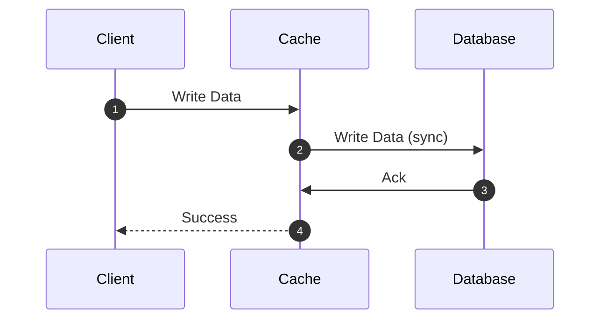
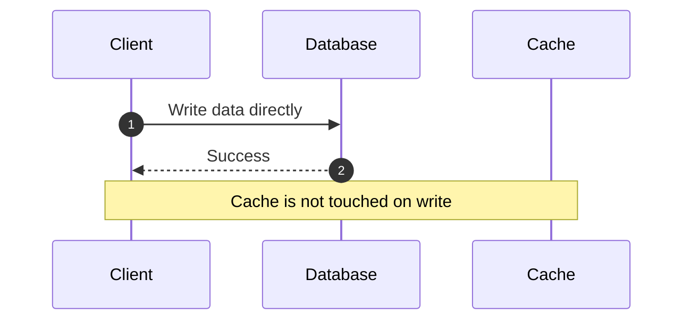
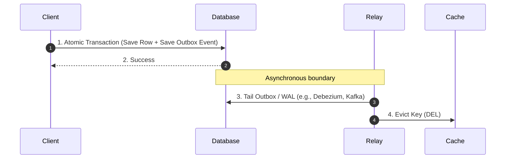
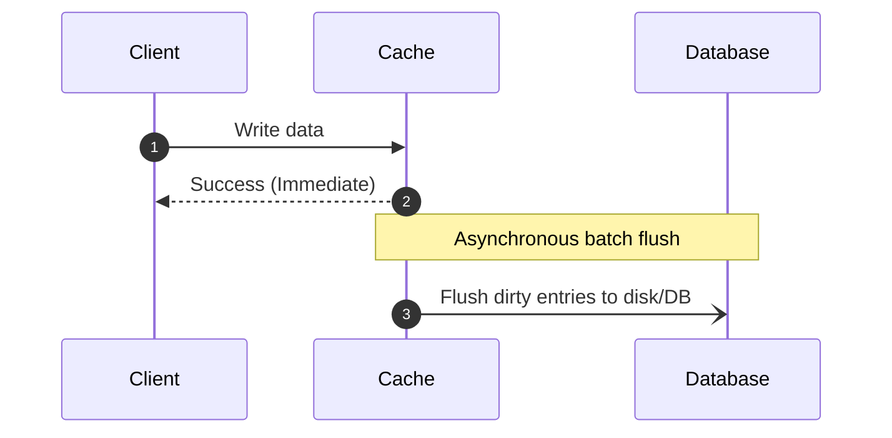
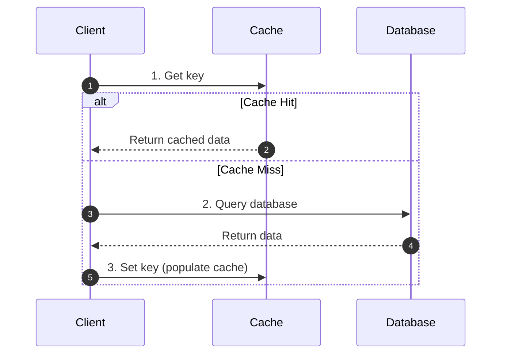

## Overview

There are four primary runtime caching strategies used in backend and distributed systems:

1. Write-through
2. Write-around
3. Write-back (Write-behind)
4. Cache-aside (Lazy Loading)

Which one you use depends on your use case (read/write ratio, latency budget) and the disadvantages you are able to live with (what failure modes can you tolerate?). Note that these are not strictly mutually exclusive. Write-around only dictates what happens on writes, so it is almost always paired with cache-aside on the read path. There are also a few cache initialization strategies on system spin up or deployment. They're mostly related to how you want to handle the cold start.

## Write-through

In a Write-Through caching strategy, we synchronously write to both cache and the primary DB before acknowledging the successful write. This is good for the systems that need strong consistency between the cache and DB at all times. Here's a diagram:



### Trade-offs

Cache and the database remain strictly in sync. Subsequent reads for newly written keys are guaranteed cache hits with zero cold-start delay. However, the synchronous nature causes high write latency (waits for two network hops and DB disk I/O). Another downside is that the memory gets allocated for every single data item that might never be read again (more below).

### Failure modes and caveats

#### Cache Churn

Cache Churn is a fast turnover of cache entries. The newly written data constantly displaces valuable working-set data, even though those new keys are rarely or never requested again. In Write-Through, every write enters cache memory. Under high write volume, the cache fills to capacity and triggers continuous evictions. Cold writes push hot data out of RAM, decreasing the cache hit ratio and shifting read spikes onto the DB.

To mitigate the cache churn, we can only use write-through for known hot/high-traffic data (active sales, top accounts etc.), and let the cold/archival data writes bypass the cache entirely.

```go
func Update(ctx context.Context, item Item) error {
    // always write to db
    if err := db.Save(ctx, item); err != nil {
        return err
    }

    // only write to cache in case of a hot key
    if item.IsSale || item.IsHotCreator {
        return cache.Set(ctx, item.Key, item, ttl)
    }

    // cold items bypass the cache
    return nil
}
```

Another way to mitigate cache churn is to use an admission filter (like [TinyLFU](https://arxiv.org/pdf/1512.00727)), which rejects cold writes if their access frequency is lower than the items currently in cache. TinyLFU relies on a frequency sketch (count-min sketch data type) to probabilistically estimate the historic usage of an entry. More about eviction policies below.

One more way to deal with high churn for write-heavy workloads is to use Write-Around instead.

#### Write-Update race conditions

In application-managed write-through setups, attempting to update the cache value directly on write introduces a subtle distributed concurrency bug.

```
Client 1: Writes v1 to DB
Client 2: Writes v2 to DB
Client 2: Writes v2 to Cache
Client 1: Writes v1 to Cache <-- arrives late due to network jitter
```

As a result, the database holds $v_2$, but the cache holds stale $v_1$ indefinitely. So, unless the caching layer provides atomic compare-and-swap or acts as an inline transactional proxy, prefer _evicting_ (`DEL`) the key on write rather than overwriting it with `SET`.


## Write-around

In a write-around strategy, write operations bypass the cache completely and write directly to the DB. The cache is only populated later when a read occurs.



### Trade-offs

Eliminates cache churn from write-heavy workloads where written data is not immediately read back (e.g., event logs, historical audit trails, ingestion pipelines). The downside is that immediate reads after a write guarantee a cache miss until lazily populated.

### Handling Stale Data in Write-Around

If a key already existed in the cache prior to the database update, write-around leaves the cache with stale data. Three common mitigations:

1. TTL Expiration: A time-to-live policy on cached entries ensures staleness is bounded.
2. Explicit Invalidation on Write: The application executes a database write followed by an explicit `DEL <key>` on the cache.
3. Change Data Capture (CDC): An asynchronous stream (Debezium or Kafka) consumes committed row updates from a DB's [WAL](/blog/write-ahead-logging) and emits cache eviction commands accordingly.

#### The Dual-Write Problem & The Transactional Outbox

A common anti-pattern in application-managed caching is issuing separate write calls to the database and cache.

```go
// Anti-pattern - partial failure corrupts the cache
err := db.UpdateUser(ctx, user) // success
if err != nil {
    return err
}
err = cache.Delete(ctx, userKey) // fails (network timeout / process OOM crash)
```

If step 2 fails after step 1 commits, the cache permanently holds stale data until TTL expiration.



This is called the dual-write problem. To mitigate the problem, an outbox pattern can be used. We write the entity update and an invalidation event record inside the same atomic database transaction. This is commonly achieved by having a special outbox table within the same database where the data lives. Then, an asynchronous worker (Debezium, Kafka) reads committed outbox events and guarantees at-least-once delivery of `DEL <key>` commands to the cache.


## Write-back (Write-behind)

In a write-back strategy, the application writes directly to the cache and immediately receives an acknowledgement. The cache subsequently flushes updates asynchronously to the backing database in batches or intervals.



### Trade-offs

A write-back strategy is used when ultra-low write latency is required. It absorbs high-write bursts and de-duplicates multiple updates to the same key into a single coalesced database write. However, we are risking permanent data loss if the cache node crashes before dirty entries are flushed. So it requires complex crash-recovery mechanics.

### Real-World Example

[Operating System Page Cache](https://www.kernel.org/doc/html/latest/admin-guide/sysctl/vm.html#dirty-background-ratio): When processes write to files, the Linux kernel writes to in-memory pages in the Page Cache, marks them "dirty", and returns immediately. Background kernel flusher threads ([`writeback`](https://www.kernel.org/doc/html/latest/admin-guide/sysctl/vm.html)) periodically flush dirty pages to physical block storage.


## Cache-aside (Lazy Loading)

In the cache-aside strategy, the application code directly orchestrates caching. It attempts to read from the cache. On cache hit, return data immediately. On cache miss - query the database, write the value into the cache, and return.



### Trade-offs

The advantage of cache-aside is that only requested data is cached (no memory wasted on cold writes). Node failures are non-fatal. If a cache instance drops, the app falls back directly to the DB and lazily repopulates replacement nodes. The disadvantage is high latency penalty on cache misses (3 round trips). It is also prone to distributed edge cases at scale.

### Critical Production Failure Modes in Cache-Aside

Because Cache-Aside decouples cache mutations from database transactions, high-concurrency systems run into five major pitfalls:

#### 1. Cache Stampede (Thundering Herd)

When a highly requested key expires or gets evicted, thousands of concurrent requests miss at the exact same millisecond. All of them rush to query the database simultaneously, causing connection pool exhaustion or DB outages.

Solutions:
  1. Request Coalescing ([Go's `singleflight`](https://pkg.go.dev/golang.org/x/sync/singleflight)): Ensures that only one in-flight DB query is executed for duplicate concurrent cache misses; all other waiting goroutines share the result.

     ```go
     var g singleflight.Group

     val, err, _ := g.Do(key, func() (interface{}, error) {
         return queryDatabase(ctx, key)
     })
     ```

  2. Probabilistic Early Expiration ([XFetch Algorithm](http://www.vldb.org/pvldb/vol8/p886-vattani.pdf)): Background workers recompute and refresh the cache key *before* it officially expires based on read frequency and computation cost ($e^{-\Delta \cdot \beta \ln(\text{rand}())}$).

  3. Lease Tokens ([Meta Memcached Paper §3.2](https://www.usenix.org/system/files/conference/nsdi13/nsdi13-nishtala.pdf)): When a miss occurs, the cache issues a temporary 64-bit lease token to exactly one client. Other concurrent readers either wait or receive slightly stale data while the leaseholder queries MySQL.

  4. Stale-While-Revalidate ([RFC 5861](https://datatracker.ietf.org/doc/html/rfc5861)): When a key expires, the application returns the stale cached value immediately to the client (zero wait time), while firing a non-blocking background goroutine to query the database and asynchronously refresh the cache entry.

#### 2. The Replica Lag Race Condition

In systems with a Primary DB and asynchronous Read Replicas:

  1. Client A updates row $X$ on the Primary DB.
  2. Client A evicts $X$ from the Cache.
  3. Client B immediately reads $X$, gets a cache miss, and queries a Read Replica.
  4. The Read Replica is lagging behind by 50ms and still holds the old value.
  5. Client B populates the Cache with the old value.

As a result, the cache is now poisoned with stale data indefinitely until the next write or TTL expiration.

Solution ([Meta's Remote Marker Pattern §4.2](https://www.usenix.org/system/files/conference/nsdi13/nsdi13-nishtala.pdf)): When updating the primary DB, write a short-lived marker key in the cache (e.g., `marker:user:123`, TTL 2 seconds). When reads miss, if a marker exists, the read is forced to query the Primary database instead of the lagging replica.

#### 3. Cache Penetration

Requests repeatedly query keys that do not exist in the database (e.g., malicious scan of `user_id = -1` or deleted IDs). Since the DB has no record, nothing is written to the cache, forcing every subsequent request directly to the DB.

Solutions:

  * Cache Nulls: Store an empty value (`key: nil`) with a short TTL (e.g., 30–60 seconds).
  * Bloom Filters: Place a Bloom filter in front of the cache to determine with certainty if an ID definitely does not exist before hitting the database.

#### 4. Cache Avalanche

Large batches of cached keys are initialized or refreshed simultaneously with identical TTLs (e.g., `TTL = 3600s`). At $t = 3600$, thousands of keys expire together, creating an instantaneous spike in database load.

Solution (TTL Jitter): Add a randomized duration to every key's expiration:
  $$\text{TTL} = \text{BaseTTL} + \text{rand}(0, \text{Jitter})$$

#### 5. Cascading Node Failures & Meta's Gutter Pools

In a distributed cluster, if a primary cache node crashes, standard consistent hashing automatically redistributes that node's traffic to neighboring live nodes. This sudden spike can overwhelm adjacent nodes, triggering a cascading crash across the entire cache fleet and dropping 100% of traffic onto the database.

Solution ([Meta Memcached Paper §4.1](https://www.usenix.org/system/files/conference/nsdi13/nsdi13-nishtala.pdf)): When a primary node fails to respond, clients redirect misses to an isolated standby tier called the Gutter Pool (~1% of fleet capacity). Gutter nodes aggressively evict entries to stay lean and act as an emergency shock absorber, protecting both surviving cache nodes and the primary database.


## Cache Initialization & Cold-Start Strategies

When deploying a new version of a service, restarting a caching node, or spinning up an ephemeral container, the cache starts completely empty (a cold start). Exposing an empty cache directly to full production traffic immediately triggers a systemic cache stampede, as thousands of requests rush past the cache and hammer the database.

Five strategies are used in production to initialize and warm cold caches:

### 1. Active Pre-Warming (Cache Seeding & Readiness Gating)

A startup worker, init container, or background routine queries the primary database or an analytics replica for the top 10–20% most active keys (Pareto principle) and populates the cache before accepting traffic.

To prevent traffic from hitting an unpopulated cache, gate the instance using [Kubernetes Readiness Probes](https://kubernetes.io/docs/concepts/workloads/pods/pod-lifecycle/#when-should-you-use-readiness-probes). The container reports not ready until the pre-warming script finishes, so the service mesh or load balancer routes zero customer requests to the node until its working set is warm. Be careful not to query the primary database unthrottled during rolling updates: ten newly starting pods will simultaneously stampede the database. Use rate limiters or query a read replica instead.

### 2. Traffic Shadowing (Dark Traffic Replay)

In blue-green deployments, before switching production traffic to the new green environment, an API gateway or service proxy (such as [Envoy's `request_mirror_policy`](https://www.envoyproxy.io/docs/envoy/latest/configuration/http/http_filters/router_filter#config-http-filters-router)) duplicates and mirrors real production read requests to the green cluster.

The green instances process the reads, lazily populate their local or remote caches, and silently discard the responses. Once the green cache hit ratio crosses your target threshold (e.g., > 95%), traffic is safely switched over with no cold-miss spike on the DB.

### 3. Snapshot Hydration (Stateful Warm Restarts)

Instead of rebuilding cache state by querying the database, the node deserializes its previous in-memory state directly from persistent disk or shared memory.

In [Redis](https://redis.io/docs/latest/operate/oss_and_stack/management/persistence/#rdb-advantages), restarting nodes can load from an RDB snapshot taken prior to restart, restoring gigabytes of keys in seconds without generating a single SQL query. For local application caches, POSIX shared memory segments (`shmget`/`mmap`) allow a replacement process to attach directly to the preceding process's in-memory cache across restarts.

### 4. Gradual Traffic Ramping (Weighted Canary Warming)

If pre-warming the full working set is impractical (for example, with millions of dynamic keys), the load balancer routes traffic to the cold cluster incrementally using weighted canary routing (such as 2% → 10% → 25% → 50% → 100% over 15 minutes).

The cache-aside pattern handles the misses lazily, but the gradual traffic step-up ensures the resulting database read volume stays comfortably within database connection pool limits.

### 5. Predictive Refresh-Ahead (Proactive Prefetching)

Rather than waiting for keys to expire and relying on on-demand lazy loading, a background scheduler predicts when hot items will be needed and warms them ahead of time.

Common examples include media platforms pre-rendering top morning news feeds into cache at 5:00 AM before commute traffic surges, or e-commerce platforms pre-warming flash sale product inventories a few minutes before scheduled drops.


## Eviction Policies: Why LRU Falls Short (W-TinyLFU)

When cache memory fills up, the eviction policy determines what gets discarded.

### LRU (Least Recently Used)

LRU evicts the item that hasn't been accessed for the longest time. The major flaw is lack of scan resistance: a single full-table scan, batch backup job, or web scraper can read millions of cold keys once, completely flushing the genuine hot working set out of memory.

### LFU (Least Frequently Used)

LFU retains items with the highest hit frequency. The issue here is stale frequency: items that were extremely popular in the past (like yesterday's viral post) accumulate high counters and remain stuck in cache long after traffic has moved on.

### W-TinyLFU (Window TinyLFU)

W-TinyLFU is a modern policy developed for Java's [Caffeine](https://github.com/ben-manes/caffeine/wiki/Efficiency) and implemented in Go by Dgraph in [Ristretto](https://dgraph.io/blog/post/introducing-ristretto-high-perf-go-cache/).

It solves both flaws by pairing a small LRU admission window (typically 1% of cache size) with a compact Count-Min Sketch frequency tracker. New items enter the admission window to catch bursty traffic. When an item is pushed out of the window, an admission filter compares its frequency against the victim candidate from the main cache segment. The new item is only admitted if its historical access frequency exceeds the eviction candidate. This provides scan resistance while quickly adapting to shifting traffic patterns.


## Engine Differences: Memcached vs. Redis

Where you host your cache dictates how these strategies perform under pressure. In managed services like [AWS ElastiCache](https://docs.aws.amazon.com/AmazonElastiCache/latest/dg/SelectEngine.html):

| Feature | Memcached | Redis |
| :--- | :--- | :--- |
| Concurrency Model | Multithreaded (scales vertically with CPU cores) | Single-threaded command execution loop (I/O helper threads in v6+) |
| Replication | None (nodes are completely independent) | Multi-AZ replication, leader-replica failover, Redis Cluster |
| Persistence | None (purely in-memory, ephemeral) | RDB snapshots & AOF (Append-Only File) persistence |
| Primary Fit | High-throughput, horizontal sharding, Cache-Aside | Complex data structures, Write-Through, reliable caching |

Memcached is multithreaded for high performance, whereas Redis traditionally handles commands on a single thread. Because Memcached nodes do not support data replication between nodes and are purely ephemeral, every strategy running on Memcached must treat node death and eviction as standard operational events (making Cache-Aside with leases the default pattern).

Redis supports persistence and replicas, allowing patterns where cache loss carries higher penalties. However, single-threaded command processing requires avoiding latency-inducing commands like `KEYS *` or large hash unlinks.

### Multi-Tier Caching: In-Process (L1) + Remote (L2)

Network round trips to Redis take ~1ms, whereas reading from the local application heap takes ~100ns. High-scale Go services frequently place an in-memory cache (L1 via Ristretto or `sync.Map`) directly in front of Redis (L2).

The main challenge is invalidation: when Pod A updates a key in Redis, how does Pod B know to invalidate its local memory?

Using [Redis Client-Side Caching](https://redis.io/docs/latest/develop/use/client-side-caching/) (`CLIENT TRACKING ON`), the Redis server tracks which keys each connected application has read. When any client modifies a key, Redis pushes an asynchronous invalidation message over a dedicated connection to all pods caching that key locally.

### Sharding & The Celebrity Problem

Distributed caches use consistent hashing (such as the [Ketama algorithm](https://www.metabrew.com/article/libketama-consistent-hashing-algo-memcached-clients)) to distribute keys across a ring of cache nodes using virtual nodes. Scaling the cluster only re-maps $K/N$ keys.

However, consistent hashing struggles with the celebrity problem: when a single entity (such as breaking news or a viral account) receives hundreds of thousands of requests per second, consistent hashing routes all of that traffic to the single cache node responsible for that key, saturating its network interface while other nodes sit idle.

To mitigate this, use key salting. Append a randomized shard suffix across $N$ replicas on write (`item:101:shard:1`, `item:101:shard:2`, ... `item:101:shard:N`) and read randomly from one of the $N$ shards, distributing the read load evenly across independent cache nodes.


## Primary Papers & Production References

### Architectural Papers

1. [Scaling Memcache at Facebook (NSDI '13)](https://www.usenix.org/system/files/conference/nsdi13/nsdi13-nishtala.pdf) - Lease tokens, remote markers, and Gutter pools for cascading failure mitigation.
2. [TAO: Facebook’s Distributed Data Store for the Social Graph (ATC '13)](https://www.usenix.org/system/files/conference/atc13/atc13-bronson.pdf) - Multi-region graph caching, write-through replication, and consistency trade-offs.
3. [Optimal Probabilistic Cache Stampede Prevention (VLDB '15)](http://www.vldb.org/pvldb/vol8/p886-vattani.pdf) - The XFetch algorithm: mathematically optimal early probabilistic expiration without locks.
4. [TinyLFU: A Highly Efficient Cache Admission Policy (ACM TOS / arXiv)](https://arxiv.org/abs/1512.00727) - The foundational paper for W-TinyLFU and Count-Min Sketch cache admission.

### Production Implementations & Docs

1. [Caffeine Cache Specification & Efficiency (Ben Manes)](https://github.com/ben-manes/caffeine/wiki/Efficiency) - Design notes and benchmarks comparing W-TinyLFU directly against classical LRU/LFU.
2. [Introducing Ristretto: A Fast, Concurrent Go Cache (Dgraph Labs)](https://dgraph.io/blog/post/introducing-ristretto-high-perf-go-cache/) - Deep dive into porting TinyLFU admission and SampledLFU eviction to Go.
3. [Redis Client-Side Caching Architecture](https://redis.io/docs/latest/develop/use/client-side-caching/) - Protocol mechanics for server-assisted tracking and invalidation messages.
4. [libketama: Consistent Hashing Library](https://www.metabrew.com/article/libketama-consistent-hashing-algo-memcached-clients) - The foundation of consistent hashing with virtual nodes.
5. [RFC 5861: HTTP Cache-Control Extensions for Stale Content](https://datatracker.ietf.org/doc/html/rfc5861) - Formal specification for stale-while-revalidate and asynchronous cache refresh.

<div class="quiz-widget">
  <div class="quiz-header">
    <svg xmlns="http://www.w3.org/2000/svg" width="22" height="22" viewBox="0 0 24 24" fill="none" stroke="currentColor" stroke-width="2" stroke-linecap="round" stroke-linejoin="round"><path d="M12 22c5.523 0 10-4.477 10-10S17.523 2 12 2 2 6.477 2 12s4.477 10 10 10z"></path><path d="M9.09 9a3 3 0 0 1 5.83 1c0 2-3 3-3 3"></path><line x1="12" y1="17" x2="12.01" y2="17"></line></svg>
    Knowledge Check <span class="quiz-progress"></span>
  </div>

  <div class="quiz-question-block" data-correct="B">
    <div class="quiz-question">In application-managed caching, why is evicting (<code>DEL</code>) a key on database write generally safer than overwriting it with <code>SET</code>?</div>
    <div class="quiz-options">
      <div class="quiz-option" data-letter="A"><div>Memory caches automatically reject <code>SET</code> commands if the DB is under load.</div></div>
      <div class="quiz-option" data-letter="B"><div>Network jitter can cause concurrent <code>SET</code> commands to arrive out of order, overwriting newer data with stale data.</div></div>
      <div class="quiz-option" data-letter="C"><div><code>DEL</code> guarantees zero memory fragmentation compared to <code>SET</code>.</div></div>
      <div class="quiz-option" data-letter="D"><div><code>DEL</code> triggers an immediate synchronous sync to read replicas.</div></div>
    </div>
    <div class="quiz-success-msg"><strong>Correct! 🎉</strong> Without compare-and-swap or an inline transactional proxy, out-of-order writes can overwrite fresh data with an earlier write's value, permanently poisoning the cache. Eviction leaves the key empty until a subsequent read lazily repopulates it.</div>
    <div class="quiz-error-msg"><strong>Not quite.</strong> The correct answer is <strong>B</strong>. Concurrent client writes can hit network delays, allowing an older <code>SET</code> to arrive after a newer one and leave stale data in cache indefinitely.</div>
  </div>

  <div class="quiz-question-block" data-correct="C">
    <div class="quiz-question">A sudden spike of 10,000 concurrent requests arrives for a newly expired key. Which solution prevents database connection exhaustion by executing only one in-flight DB query for all waiting requests?</div>
    <div class="quiz-options">
      <div class="quiz-option" data-letter="A"><div>Bloom Filters</div></div>
      <div class="quiz-option" data-letter="B"><div>Consistent Hashing with virtual nodes</div></div>
      <div class="quiz-option" data-letter="C"><div>Request Coalescing (such as Go's <code>singleflight</code>)</div></div>
      <div class="quiz-option" data-letter="D"><div>Increasing the database connection pool limit</div></div>
    </div>
    <div class="quiz-success-msg"><strong>Correct! 🎉</strong> Request coalescing (like Go's <code>singleflight.Group</code>) deduplicates duplicate in-flight requests, executing one query to the database and sharing the result with all waiting callers.</div>
    <div class="quiz-error-msg"><strong>Not quite.</strong> The correct answer is <strong>C</strong>. Request coalescing deduplicates concurrent in-flight misses so only a single database query is executed, shielding the database during a thundering herd.</div>
  </div>

  <div class="quiz-question-block" data-correct="B">
    <div class="quiz-question">Why can a simple cache eviction on write cause cache poisoning in systems with asynchronous read replicas?</div>
    <div class="quiz-options">
      <div class="quiz-option" data-letter="A"><div>Read replicas reject incoming connections until the cache acknowledges eviction.</div></div>
      <div class="quiz-option" data-letter="B"><div>A concurrent read miss can query a lagging replica and populate the cache with pre-update stale data.</div></div>
      <div class="quiz-option" data-letter="C"><div>Eviction messages are transmitted over UDP and often dropped in cross-replica networks.</div></div>
      <div class="quiz-option" data-letter="D"><div>Read replicas automatically re-insert dropped keys into Redis via replication streams.</div></div>
    </div>
    <div class="quiz-success-msg"><strong>Correct! 🎉</strong> If a read miss occurs before a replica catches up with the primary, the reader queries the lagging replica and caches the old value indefinitely (which Meta solves using remote markers).</div>
    <div class="quiz-error-msg"><strong>Not quite.</strong> The correct answer is <strong>B</strong>. When read replicas lag behind the primary, a cache miss can fetch and cache stale data from the replica right after eviction.</div>
  </div>

  <div class="quiz-question-block" data-correct="B">
    <div class="quiz-question">What major vulnerability in standard LRU (Least Recently Used) does W-TinyLFU address?</div>
    <div class="quiz-options">
      <div class="quiz-option" data-letter="A"><div>LRU cannot store values larger than 1 MB.</div></div>
      <div class="quiz-option" data-letter="B"><div>A full-table scan or web scraper can read millions of cold keys once and flush genuine hot data out of cache.</div></div>
      <div class="quiz-option" data-letter="C"><div>LRU requires single-threaded command processing to track timestamps.</div></div>
      <div class="quiz-option" data-letter="D"><div>LRU evicts popular items whenever their TTL exceeds 1 hour.</div></div>
    </div>
    <div class="quiz-success-msg"><strong>Correct! 🎉</strong> LRU lacks scan resistance: one-off sequential reads will displace your high-value working set. W-TinyLFU uses an admission filter backed by a Count-Min Sketch to admit new keys only if they are likely hotter than the eviction candidate.</div>
    <div class="quiz-error-msg"><strong>Not quite.</strong> The correct answer is <strong>B</strong>. Standard LRU lacks scan resistance, meaning a single large scan or crawler can evict the entire working set with keys that will never be accessed again.</div>
  </div>

  <div class="quiz-question-block" data-correct="C">
    <div class="quiz-question">What is the primary role of the "Gutter Pool" in Meta's Memcached architecture?</div>
    <div class="quiz-options">
      <div class="quiz-option" data-letter="A"><div>To store discarded keys for offline analytics.</div></div>
      <div class="quiz-option" data-letter="B"><div>To act as an asynchronous write-back buffer for MySQL writes.</div></div>
      <div class="quiz-option" data-letter="C"><div>To act as a standby shock absorber for failed cache nodes, preventing cascading fleet crashes and database overload.</div></div>
      <div class="quiz-option" data-letter="D"><div>To replicate hot keys across multiple geographical regions.</div></div>
    </div>
    <div class="quiz-success-msg"><strong>Correct! 🎉</strong> When a primary cache node goes down, consistent hashing could overload adjacent surviving nodes. The Gutter Pool absorbs that traffic with aggressive eviction, shielding both the fleet and MySQL.</div>
    <div class="quiz-error-msg"><strong>Not quite.</strong> The correct answer is <strong>C</strong>. The Gutter Pool is an emergency standby tier that absorbs traffic from unresponsive cache nodes so adjacent nodes aren't crushed by rehashed load.</div>
  </div>

  <div class="quiz-footer">
    <button class="quiz-next-btn">Next Question →</button>
  </div>
  
  <div class="quiz-results">
    <h4>Quiz Complete!</h4>
    <p>You scored <strong class="quiz-score">0</strong> out of <strong>5</strong>.</p>
  </div>
</div>
