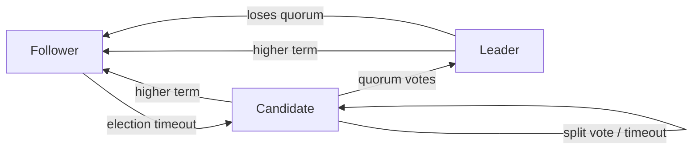
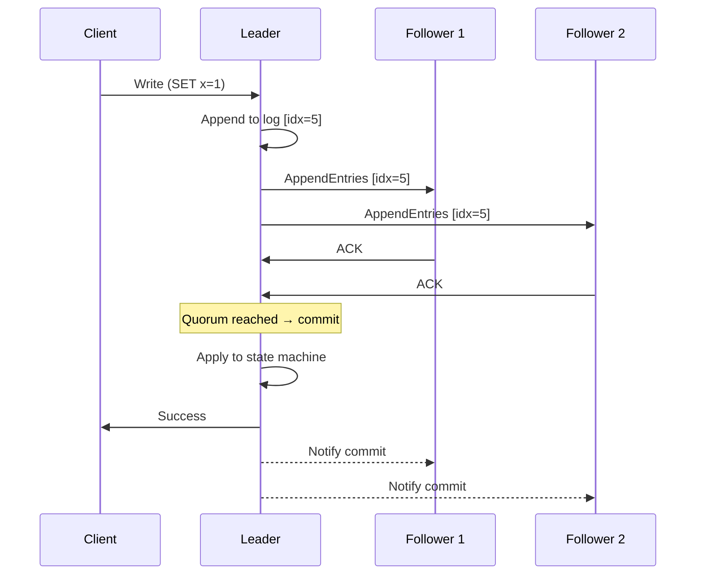
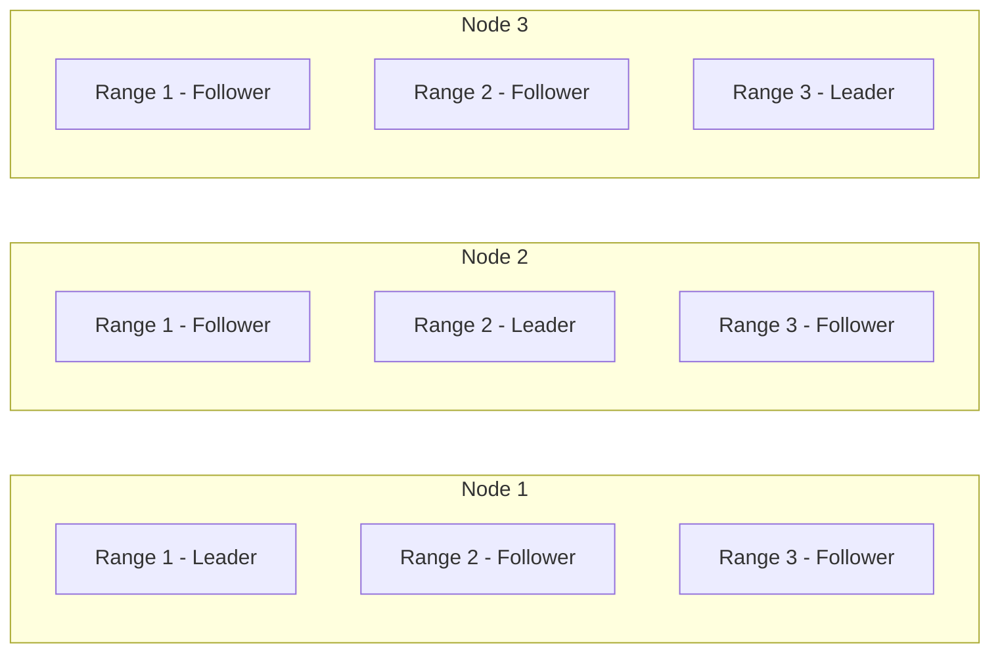
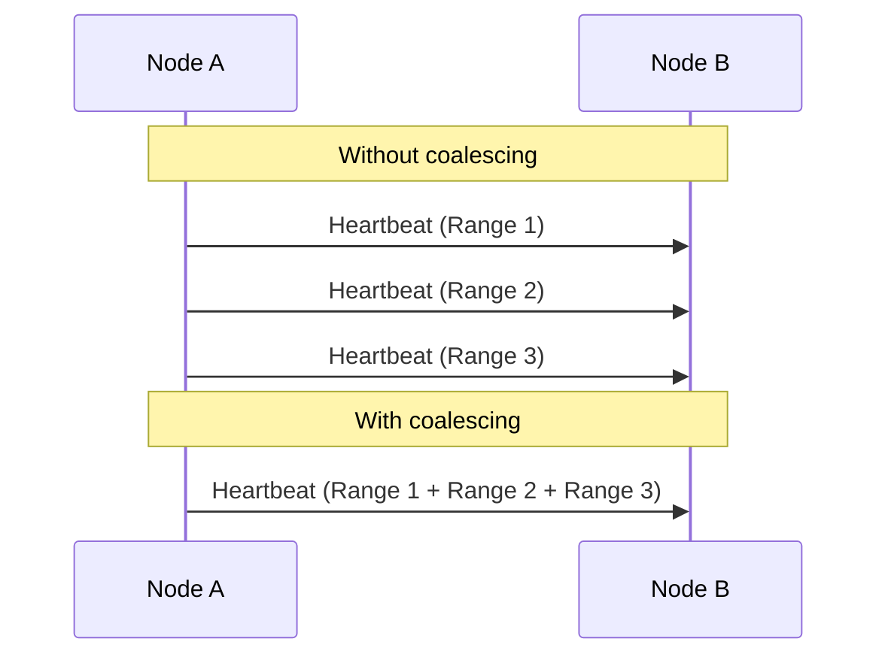
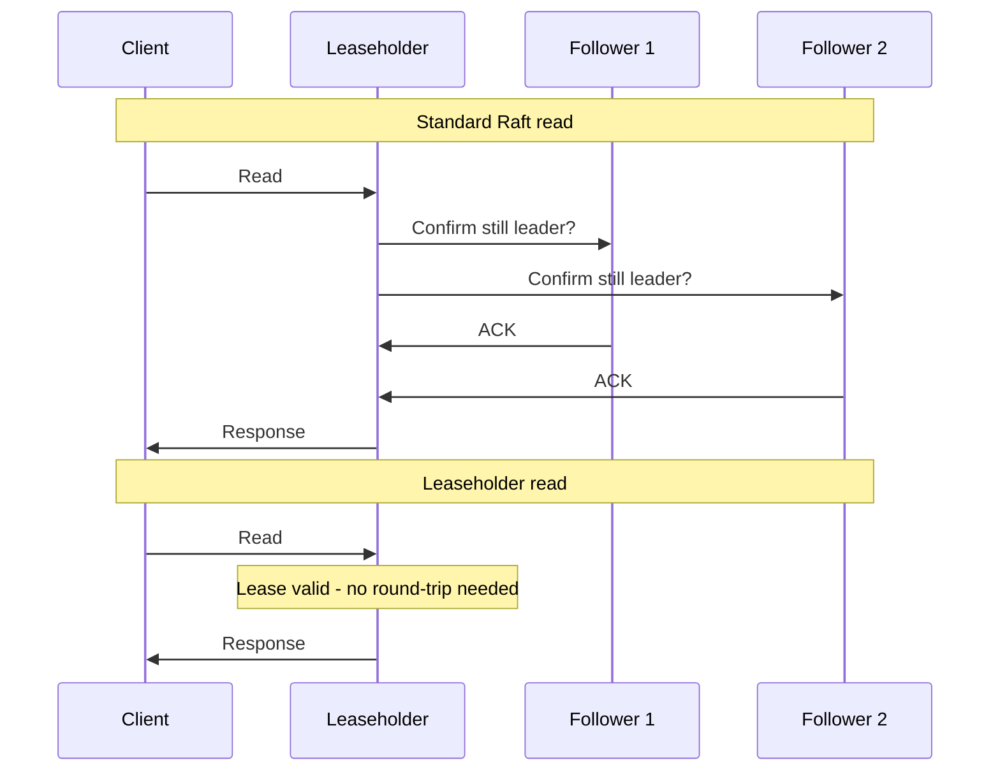
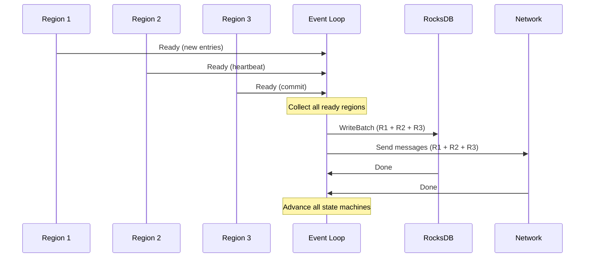
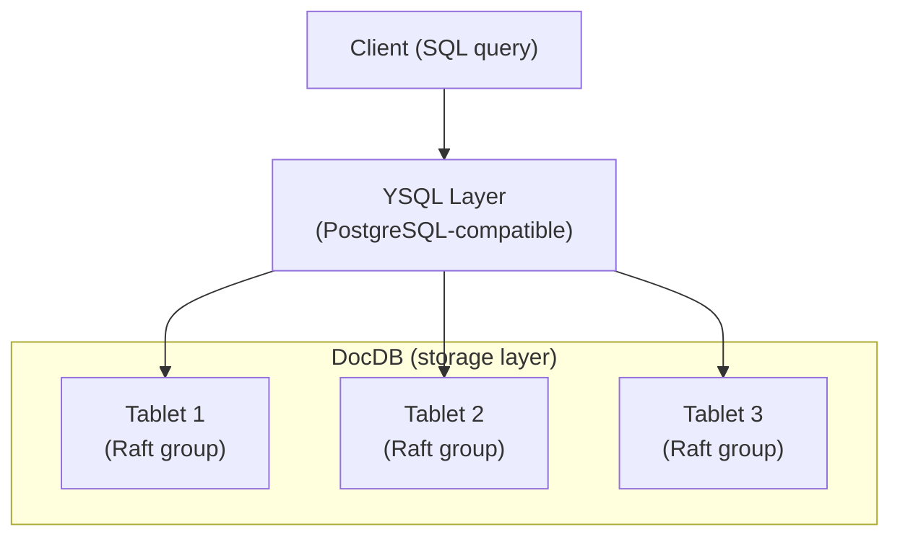
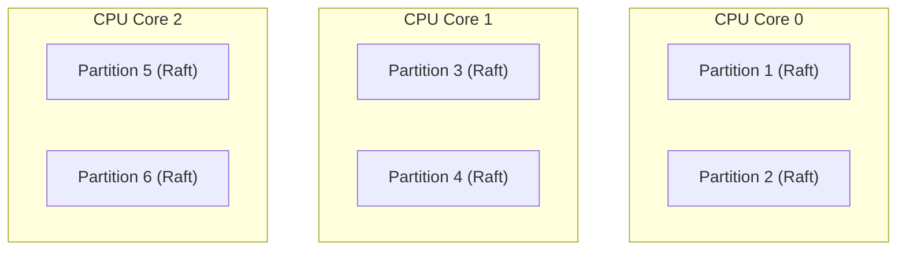

**TL;DR** Single-group Raft routes all writes through one leader, which becomes a bottleneck at scale. Multi-Raft splits the keyspace into independent ranges, each with its own Raft group and leader, so writes can proceed in parallel. Real systems like CockroachDB, TiKV, YugabyteDB, and Redpanda all do this, but differ in how they handle the operational overhead of running thousands of consensus groups at once. The hard part isn't sharding the writes - it's atomically updating keys that land in different ranges.

## How single-group Raft works

In single-group Raft, all nodes participate in **one** consensus group:

* One node is elected **leader**, all others are followers.
* Every write goes to the leader, which appends it to its **log** and replicates it to its followers.
  * A *log* is an append-only sequence of commands (or entries) that represent every write operation, in order. Each entry gets an index and a **term** (which election cycle it was created in).
  * The *log* is also used for node recovery - the restarted node replays its log to rebuild state.
* Once a **quorum** (majority) of the nodes acknowledges the entry, it's committed and applied to the *state machine*.
  * In the Raft context, a state machine is whatever system you're keeping consistent - a key-value store, a database, a configuration registry, etc. The idea is that if every node starts from the same initial state and applies the same log entries in the same order, they all end up with identical state. Raft's job is to guarantee that ordering.
* If the *leader fails*, followers hold a new **election**. The node with the most up-to-date log wins.
* Reads can be served from the *leader* (strong consistency) or *followers* (with caveats):
  * If the reads are served from followers, they might be **stale**. A follower's log might lag behind the leader's. A follower has no way to know it's behind without checking the leader.
  * To *mitigate* the stale reads, the following techniques might be employed:
    * **lease reads** (the leader holds a time-based lease guaranteeing it's still the leader),
    * **linearizable reads** (the leader confirms it's still the leader by getting a quorum heartbeat acknowledgment before serving the read, *adds latency*),
    * **follower reads with bounded staleness** (acceptable in some use cases where slightly stale data is tolerable, e.g. caches or analytics).
  * Most systems that allow *follower reads* expose this as an explicit consistency knob (e.g. CockroachDB's `AS OF SYSTEM TIME`, TiKV's follower read).

Here are a few diagrams.

### Node State Machine (leader election)

The diagram below shows the three states a Raft node can be in and how it moves between them:

**Follower** - the default state. A node stays here as long as it keeps receiving heartbeats from a leader. If the heartbeat times out (leader is dead or unreachable), it promotes itself to Candidate.

**Candidate** - the node votes for itself and asks others to vote for it. Three outcomes:

* Wins a majority → becomes Leader
* Hears from a node with a higher term (more recent election) → steps back to Follower
* Nobody wins (split vote) → restarts the election and stays Candidate

**Leader** - handles all writes and sends periodic heartbeats. Two ways to lose leadership:

* Hears from a node with a higher term → steps down to Follower
* Loses quorum (too many nodes unreachable) → steps down to Follower

The key insight: there is **no direct Follower → Leader** path. A node **must campaign first**.

### Log Replication Flow

### Log State Across Nodes

Not all nodes have the same log at any given moment, followers can lag behind the leader, for example:

| Node | Log |
| --- | --- |
| Leader | `[1][2][3][4][5]` |
| Follower 1 | `[1][2][3][4][5]` |
| Follower 2 | `[1][2][3][4]` |
| Follower 3 | `[1][2]` |

Raft **doesn't require** all nodes to be up to date, only a quorum (majority). Entries 1–5 are already committed because the leader + follower 1 + follower 2 = 3 out of 4 nodes acknowledged them. Follower 3 will catch up eventually.

### The problem with single-group Raft

Every write serializes through a single leader. As throughput demands grow, that one leader becomes the ceiling - you can add more nodes, but they only improve fault tolerance, not write throughput.

* **Hot key problem**. Even if your dataset is large and distributed across many machines, a single Raft leader means all writes to any key funnel through one node. One popular key can saturate the leader regardless of how much hardware you have.
* The leader is a **single point of CPU/network pressure**. It must send *AppendEntries* to every follower for every write. With many followers, this fan-out becomes expensive.
* **Snapshots and log compaction**. As the log grows unboundedly, compaction becomes a heavyweight operation that competes with normal leader duties.
* **Geographic distribution** is hard. Placing followers in distant regions increases *replication latency*, which directly hurts write commit latency since the leader waits for a quorum ACK. Amazon RDS Multi-AZ is a familiar instance of this: it places a synchronous standby in a separate availability zone for failover, but all writes still route through a single primary.

The answer is to stop thinking of the cluster as one consensus group, and start thinking of it as many.

## Multi-Raft

If you have petabytes of data, you can't put it into a single Raft log. The leader would become a **massive bottleneck**, and re-syncing a lagging follower would take weeks.

Let's say we have 1PB of data and network bandwidth between the nodes ~ 1 Gbps (125 MB/s)

$$1 PB = 1,000,000\ GB = 1,000,000,000\ MB$$
$$1,000,000,000\ MB ÷ 125\ MB/s = 8,000,000\ seconds$$
$$= 133,333\ minutes$$
$$= 2,222\ hours$$
$$= ~92\ days$$

Even at 10 Gbps:
$$1,000,000,000\ MB ÷ 1,250\ MB/s = 800,000\ seconds ≈ 9\ days$$

At petabyte scale, re-syncing a follower over a 10 Gbps link would take roughly 9 days under ideal conditions (assuming the link is 100% dedicated to replication with no competing traffic, no CPU overhead, no disk I/O bottleneck on the receiving end) - far longer in practice.

To solve this, modern distributed systems use **Multi-Raft**.

In Multi-Raft, the keyspace is split into **ranges** (sometimes called shards or regions). Each range covers a contiguous slice of the keyspace and is managed by its own independent Raft group, with its own leader, its own log, and its own set of replicas. A write to key `a` goes to range 1's leader; a write to key `z` goes to range 2's leader - in parallel, with no coordination between them.

This unlocks what single-group Raft cannot provide:

* **Horizontal write throughput** - multiple leaders accept writes simultaneously
* **Bounded resync** - a lagging follower only needs to catch up on its range's log, not the entire dataset
* **Geographic flexibility** - each range's leader can be placed close to the clients that write to it

### How it looks in practice

Several real systems are built exactly this way.

#### CockroachDB

CockroachDB splits data into **512 MB ranges by default**, each backed by an **independent Raft group**. A single node in a large cluster can be a member of tens of thousands of Raft groups simultaneously.

To keep heartbeat traffic from overwhelming the network, *CockroachDB coalesces all heartbeats between any two nodes into a single RPC*, reducing overhead from O(ranges) to O(nodes).

CockroachDB also introduces the concept of a **leaseholder**: the Raft leader is granted a **time-based lease** during which it can serve reads locally, without a quorum round-trip. This avoids the latency cost of standard Raft where every read requires confirmation that the leader hasn't been deposed.

([Cockroach Labs Blog: Scaling Raft](https://www.cockroachlabs.com/blog/scaling-raft/))

#### TiKV

TiKV (the storage layer behind TiDB, a distributed SQL database) calls its ranges **regions** (default 96 MB) and uses a **placement driver** to manage leader distribution and rebalancing. The naive approach to managing thousands of Raft groups would be **one thread per group**. TiKV avoids this by driving all Raft state machines through a **shared event loop written in Rust**, processing multiple ready-states in a single batch to reduce context-switching overhead.

TiKV's event loop is essentially a pipeline. At each tick it *collects all Raft groups* that have something to do (new entries, heartbeats, timeouts), *processes* them together, *writes to RocksDB* in one batch, then sends all network messages. Here's how that looks:

([TiKV Blog: Building a large-scale distributed storage system based on Raft](https://tikv.org/blog/building-distributed-storage-system-on-raft/))

#### YugabyteDB

YugabyteDB is an open-source distributed SQL database built by Yugabyte. It's PostgreSQL-compatible at the SQL layer (YSQL) and sits on top of a distributed storage engine called DocDB, which is where the Multi-Raft logic lives.

YugabyteDB splits data into **tablets** and runs an independent **Raft group per tablet**. To reduce the heartbeat overhead of thousands of groups, it uses a **MultiRaft layer that multiplexes heartbeats** across groups sharing the same set of nodes - similar in spirit to CockroachDB's coalescing but at the library level. YSQL sits above DocDB and translates queries into operations that may fan out across multiple tablet Raft groups.

([YugabyteDB Blog: How Raft-based replication works in YugabyteDB](https://www.yugabyte.com/blog/how-does-the-raft-consensus-based-replication-protocol-work-in-yugabyte-db/))

#### Redpanda

Redpanda is a Kafka-compatible streaming platform where each *partition* is its own Raft group. This gives stronger consistency guarantees than Kafka's ISR replication, which can acknowledge a write before all in-sync replicas have persisted it.

Rather than managing thousands of Raft groups with a shared thread pool, Redpanda uses a **thread-per-core** architecture via the *Seastar framework* - each CPU core owns a fixed set of partitions and their Raft groups exclusively, eliminating lock contention and context switching entirely.

([Redpanda Blog: Simplifying Raft replication in Redpanda](https://www.redpanda.com/blog/simplifying-raft-replication-in-redpanda))

| System | Range name | Default size | Language | Scaling strategy |
| --- | --- | --- | --- | --- |
| CockroachDB | Range | 512 MB | Go | Heartbeat coalescing + leaseholder reads |
| TiKV | Region | 96 MB | Rust | Shared event loop, batch I/O |
| YugabyteDB | Tablet | configurable | C++ | MultiRaft library, two-layer SQL/storage |
| Redpanda | Partition | N/A (streaming) | C++ | Thread-per-core via Seastar |

Each system makes different tradeoffs in range size, leader placement, and, most critically, how they handle writes that touch more than one range.

### Day 2 challenges

Running Multi-Raft in production surfaces problems that don't show up in a 3-node test cluster.

**Election storm.** When a node holding thousands of Raft leaders crashes, that many elections fire simultaneously. Followers across the cluster all hit their election timeout at roughly the same time and flood the network with `RequestVote` RPCs. Real implementations mitigate this with randomized election timeouts - each group waits a slightly different amount of time before starting an election - and priority-based leadership, where the cluster steers elections toward nodes that were already leaders to restore the previous distribution faster.

**Log truncation.** The Raft log cannot grow forever - it must be periodically compacted. But truncating too aggressively means a lagging follower may no longer be able to catch up incrementally; it needs a full snapshot of the state machine instead, which is far more expensive. The tradeoff is between disk usage and the cost of snapshot transfer, and getting it wrong in either direction causes operational pain under load.

**Range splitting.** When a range grows too large or becomes a hotspot, it must be split into two - which means creating a new Raft group on the fly, electing a leader for it, and redistributing replicas, all without interrupting writes to the affected keyspace.

### The hard part: cross-range transactions

Multi-Raft gives you independent consensus groups per range. A write to range 1 and a write to range 2 can proceed in parallel with no coordination between them. But what happens when a single transaction needs to atomically update keys in both?

Take a bank transfer: debit account A in range 1, credit account B in range 2. Both changes must either commit or roll back together. There is no Raft group that spans both ranges. Each one only knows about its own log.

DynamoDB faces the same problem. Its `TransactWriteItems` API provides ACID transactions across multiple items in different partitions, but [the 2PC mechanism requires two operations per item](https://docs.aws.amazon.com/amazondynamodb/latest/developerguide/transaction-apis.html#transaction-capacity-handling) (one prepare, one commit), so each transactional write consumes twice the capacity units of a standard write. That is the cost of coordination, not a surcharge (apparently).

**Two-phase commit (2PC)**:

1. **Prepare**: A transaction coordinator sends a "prepare" to all involved range leaders. Each range tentatively locks the rows and votes yes or no.
2. **Commit**: If all ranges voted yes, the coordinator sends "commit." If any voted no, it sends "abort."

The hard part is not the happy path. It is what happens when the coordinator crashes between prepare and commit. The involved ranges are left holding locks with no further instruction. They cannot commit (the coordinator never confirmed) and they cannot safely abort (the coordinator might have committed before dying).

**CockroachDB** solves this by making the transaction record itself a replicated key. Before writing to any range, the coordinator writes a **transaction record** to one of the involved ranges. Provisional writes ("write intents") are stored in place alongside normal data. Any reader that encounters an intent looks up the transaction record to determine whether it committed. If the coordinator dies, the transaction record is the source of truth: no ambiguity, no stuck locks.

**TiKV** uses a model inspired by Google's **Percolator**. One key in the transaction is designated the **primary lock**. The transaction commits atomically by writing to the primary key's Raft group. All secondary writes point back to the primary. Any node encountering a secondary lock can follow the pointer to the primary and determine the outcome from there.

In both cases, a cross-range transaction requires at least two quorum writes (one per range) plus the coordination overhead of the transaction record or primary lock. This is the unavoidable cost of Multi-Raft: you get parallel write throughput across ranges, but atomicity across them always requires coordination.

### Wrapping up

Multi-Raft is not a single design, it is a family of tradeoffs. Every system here splits data into independent consensus groups, but they diverge immediately on what to optimize: CockroachDB minimizes network overhead with heartbeat coalescing and cuts read latency with leases; TiKV batches I/O through a shared event loop to reduce context switching; YugabyteDB keeps the SQL and storage layers cleanly separated; Redpanda eliminates scheduler overhead entirely by pinning partitions to cores.

The common thread is **minimizing the coordination tax**, the overhead that consensus imposes on every operation. At scale, that tax compounds fast, and each of these systems found a different way to contain it.

## Further reading

### Raft

* [In Search of an Understandable Consensus Algorithm](https://raft.github.io/raft.pdf) - Diego Ongaro & John Ousterhout (the original paper)
* [The Raft Consensus Algorithm](https://raft.github.io) - interactive visualizations

### CockroachDB

* [Scaling Raft](https://www.cockroachlabs.com/blog/scaling-raft/) - Ben Darnell, Cockroach Labs
* [Parallel Commits: An atomic commit protocol for globally distributed transactions](https://www.cockroachlabs.com/blog/parallel-commits/) - Nathan VanBenschoten, Cockroach Labs
* [Transaction Layer](https://www.cockroachlabs.com/docs/stable/architecture/transaction-layer) - CockroachDB docs (write intents, transaction records)

### TiKV

* [Building a Large-scale Distributed Storage System Based on Raft](https://tikv.org/blog/building-distributed-storage-system-on-raft/) - Edward Huang, TiKV
* [Multi-Raft](https://tikv.org/deep-dive/scalability/multi-raft/) - TiKV deep dive

### YugabyteDB

* [How Does the Raft Consensus-Based Replication Protocol Work in YugabyteDB?](https://www.yugabyte.com/blog/how-does-the-raft-consensus-based-replication-protocol-work-in-yugabyte-db/) - Yugabyte

### Redpanda

* [Simplifying Redpanda Raft implementation](https://www.redpanda.com/blog/simplifying-raft-replication-in-redpanda) - Redpanda

### Cross-range transactions

* [Large-scale Incremental Processing Using Distributed Transactions and Notifications](https://research.google/pubs/large-scale-incremental-processing-using-distributed-transactions-and-notifications/) - Daniel Peng & Frank Dabek, Google (the Percolator paper)

  

    <svg xmlns="http://www.w3.org/2000/svg" width="22" height="22" viewBox="0 0 24 24" fill="none" stroke="currentColor" stroke-width="2" stroke-linecap="round" stroke-linejoin="round"><path d="M12 22c5.523 0 10-4.477 10-10S17.523 2 12 2 2 6.477 2 12s4.477 10 10 10z"></path><path d="M9.09 9a3 3 0 0 1 5.83 1c0 2-3 3-3 3"></path><line x1="12" y1="17" x2="12.01" y2="17"></line></svg>
    Knowledge Check 
  

  

    
In the standard Raft protocol, what is the <em>only</em> way for a Follower to become a Leader?

    

      

The current Leader sends a "transfer leadership" RPC directly to the Follower.

      

The Follower must first transition to a Candidate and win an election by gathering a quorum of votes.

      

A Follower with the longest uptime automatically promotes itself when the Leader dies.

      

The network routing layer elects a new Leader based on latency metrics.

    

    
<strong>Correct! 🎉</strong> There is no direct "Follower to Leader" path. A node must notice the Leader is gone, promote itself to Candidate, vote for itself, and secure a majority of cluster votes.

    
<strong>Not quite.</strong> The correct answer is <strong>B</strong>. A Follower must always transition to a Candidate state and actively campaign to win an election before becoming a Leader.

  

  

    
Why does adding more nodes to a single-group Raft cluster NOT increase write throughput?

    

      

Because every write must still be serialized through a single Leader node.

      

Because network bandwidth decreases logarithmically as more nodes are added.

      

Because Followers actively reject writes if there are too many nodes in the cluster.

      

Because Raft requires 100% of nodes to acknowledge a write before committing.

    

    
<strong>Correct! 🎉</strong> In single-group Raft, that one Leader is the ceiling. Adding more nodes only improves fault tolerance (and potentially read throughput, if stale reads are allowed), but the single Leader remains the write bottleneck.

    
<strong>Not quite.</strong> The correct answer is <strong>A</strong>. All writes in single-group Raft must go through one Leader. No matter how many followers you add, that one Leader node limits how fast you can write.

  

  

    
What is a major risk of allowing clients to read directly from a Follower node in standard Raft?

    

      

The Follower might accidentally overwrite the data during the read.

      

The Follower might return stale data because its log lags behind the Leader's log.

      

The Follower will automatically trigger an unnecessary election storm.

      

The Follower is forced to lock the entire database during the read.

    

    
<strong>Correct! 🎉</strong> Raft does not guarantee that every follower has the latest data at all times (only a quorum is required for commit). A follower might be lagging, meaning reads served from it will be stale.

    
<strong>Not quite.</strong> The correct answer is <strong>B</strong>. Because a quorum commit doesn't require *all* nodes to acknowledge a write, a follower might not have received the latest updates yet, leading to stale reads.

  

  

    
How does CockroachDB prevent tens of thousands of independent Raft groups from overwhelming the network with heartbeat messages?

    

      

It entirely disables heartbeats and relies on TCP keepalives instead.

      

It coalesces all heartbeats between any two physical nodes into a single multiplexed RPC.

      

It only sends heartbeats for groups that are actively processing writes.

      

It routes all heartbeats through a centralized "heartbeat server."

    

    
<strong>Correct! 🎉</strong> Instead of sending 10,000 heartbeats between Node A and Node B for 10,000 different ranges, CockroachDB batches them together, reducing the network overhead to O(nodes) instead of O(ranges).

    
<strong>Not quite.</strong> The correct answer is <strong>B</strong>. CockroachDB uses heartbeat coalescing to bundle the heartbeats of thousands of ranges into a single network request between physical nodes.

  

  

    
What mechanism does TiKV use to efficiently manage thousands of Raft groups on a single node without causing massive OS thread contention?

    

      

A strict thread-per-core architecture that pins each group to a specific CPU.

      

A shared event loop that batches ready states and processes them together before writing to RocksDB.

      

It uses Python's asyncio to multiplex the groups.

      

It delegates group management entirely to the Linux kernel using eBPF.

    

    
<strong>Correct! 🎉</strong> Instead of one thread per group, TiKV uses an event loop that collects all groups with pending work, processes them in a batch, and issues a single WriteBatch to RocksDB.

    
<strong>Not quite.</strong> The correct answer is <strong>B</strong>. TiKV avoids the "thread-per-group" problem by driving all Raft state machines through a highly optimized, shared Rust event loop.

  

  

    
How does Redpanda's approach to Multi-Raft execution differ from TiKV's shared event loop?

    

      

Redpanda uses a thread-per-core architecture (via Seastar) where each CPU exclusively owns a fixed set of partitions.

      

Redpanda uses a global lock around its shared event loop to prevent race conditions.

      

Redpanda runs each Raft group in its own isolated Docker container.

      

Redpanda relies on ZooKeeper to manage the state machines instead of Raft.

    

    
<strong>Correct! 🎉</strong> Built on the Seastar framework, Redpanda pins threads to CPU cores and assigns specific partitions to specific cores, eliminating context switching and lock contention entirely.

    
<strong>Not quite.</strong> The correct answer is <strong>A</strong>. Redpanda uses a strict thread-per-core model. A CPU core entirely owns its subset of Raft groups, meaning no locking or cross-thread synchronization is required.

  

  

    
What causes the "election storm" problem in Multi-Raft clusters?

    

      

When a network partition causes nodes to rapidly toggle between Leader and Follower.

      

When the cluster administrator manually triggers elections too frequently.

      

When a node holding thousands of Leaders crashes, causing thousands of Followers to hit their election timeouts simultaneously.

      

When nodes with older logs repeatedly win elections over nodes with newer logs.

    

    
<strong>Correct! 🎉</strong> A single node going down can sever the heartbeats for thousands of Raft groups at exactly the same time. All those followers wake up instantly and flood the network with RequestVote RPCs.

    
<strong>Not quite.</strong> The correct answer is <strong>C</strong>. Because one physical node can hold thousands of Raft Leaders, its death causes thousands of concurrent election timeouts across the cluster, flooding the network.

  

  

    
Why is Two-Phase Commit (2PC) inherently difficult in a Multi-Raft architecture?

    

      

Because Raft logs are append-only and cannot store transactional lock metadata.

      

If the transaction coordinator crashes between the "prepare" and "commit" phases, the ranges are left holding locks with no idea what to do.

      

Because 2PC requires a centralized hardware clock, which distributed systems don't have.

      

Because ranges are strictly forbidden from communicating with each other over the network.

    

    
<strong>Correct! 🎉</strong> The classic 2PC failure mode is a dead coordinator. Systems like CockroachDB (transaction records) and TiKV (Percolator primary locks) solve this by writing the transaction's status into a replicated key so any node can verify the outcome if the coordinator dies.

    
<strong>Not quite.</strong> The correct answer is <strong>B</strong>. The danger of 2PC is a coordinator crashing mid-flight. Without a reliable mechanism to resolve stuck locks (like transaction records or primary keys), the database grinds to a halt.

  

  

    <button class="quiz-next-btn">Next Question →</button>
  

  
  

    <h4>Quiz Complete!</h4>
    
You scored <strong class="quiz-score">0</strong> out of <strong>8</strong>.

  

