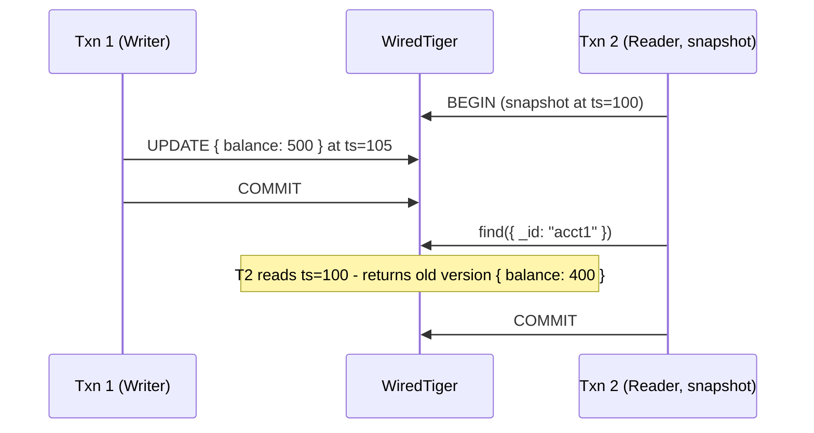

[I wrote about MVCC in Postgres, MySQL (InnoDB), and CockroachDB](/blog/mvcc), and now I want to understand how it works in WiredTiger, the storage engine behind MongoDB.

## MVCC Recap
MVCC, or Multi-Version Concurrency Control, keeps multiple versions of a row, gives each transaction a snapshot, lets readers and writers proceed without blocking each other. 

### xmin/xmax (Postgres)
Postgres uses xmin/xmax fields to keep track of the visibility of rows. Each row has an xmin and xmax field, which are set to the transaction id of the transaction that created the row and the transaction id of the transaction that deleted the row, respectively.

### CockroachDB - timestamps + HLC
CockroachDB uses hybrid logical clocks (HLC) to keep track of the visibility of rows. Each row has a start and end timestamp, which are set to the HLC of the transaction that created the row and the HLC of the transaction that deleted the row, respectively.

### InnoDB (MySQL)
InnoDB uses undo logs to keep track of the visibility of rows. Each transaction is assigned a transaction id. Each row is either the latest version of a row, or an older version that is stored in the undo log. If the row is the latest version, it has a start transaction id and an end transaction id of null. If the row is an older version, it has a start transaction id and an end transaction id that are set to the transaction id of the transaction that created the row and the transaction id of the transaction that deleted the row, respectively.

## MongoDB - WiredTiger, why MVCC came late, what it enables
MongoDB delegates storage to **[WiredTiger](https://www.mongodb.com/docs/manual/core/wiredtiger/)**, a pluggable storage engine it acquired in 2014 and made the [default in MongoDB 3.2](https://www.mongodb.com/docs/manual/core/wiredtiger/). WiredTiger brings its own MVCC implementation, its own concurrency model, and its own cleanup story. MongoDB's transaction and isolation semantics sit on top of it.

**WiredTiger** is a key-value store backed by B-trees. MongoDB maps each collection to a WiredTiger B-tree, where the key is the document's `_id` and the value is the `BSON`-encoded document.
Every value in WiredTiger is stored with a timestamp. When a document is updated, WiredTiger writes the new version at the transaction's commit timestamp and retains the old version at its original timestamp. Readers see the version that existed at their read timestamp. This is structurally similar to CockroachDB's approach - versions keyed by (key, timestamp) rather than (key, transaction ID) for the same reason - timestamps compose more naturally than integer IDs when multiple components need to agree on ordering.


## Snapshots and Read Timestamps

When a read operation starts in MongoDB, WiredTiger assigns it a **read timestamp**. The read sees all committed versions at or before that timestamp and ignores everything newer.

For single-document operations, this happens implicitly. For multi-document transactions, you control it explicitly through [**read concern**](https://www.mongodb.com/docs/manual/reference/read-concern/):

| Read Concern | Meaning |
|--------------|---------|
| `local`      | Most recent committed data on this node, no timestamp coordination |
| `majority`   | Data acknowledged by a majority of replica set members |
| `snapshot`   | Consistent snapshot across all documents in the transaction, at the same timestamp |

`snapshot` read concern is what gives MongoDB consistent point-in-time reads across all documents in a multi-document transaction. Without it, a transaction reading multiple documents could see them at different points in time. Note that this is snapshot isolation, not serializability - write skew anomalies are still possible.



T2 sees the document as it existed at ts=100, even though T1 committed a newer version at ts=105. Same guarantee as PostgreSQL's repeatable read, achieved through timestamps rather than transaction ID snapshots.

## Write Conflicts

Unlike PostgreSQL, which detects write-write conflicts when a second transaction attempts to modify an already-locked row (blocking until the first commits or aborts), WiredTiger detects them eagerly. If two transactions attempt to modify the same document, the second one to try gets a [`WriteConflict`](https://www.mongodb.com/docs/manual/reference/command/serverStatus/#mongodb-serverstatus-serverstatus.wiredTiger.concurrentTransactions) error immediately. It does not wait.

MongoDB [retries `WriteConflict` errors automatically](https://www.mongodb.com/docs/manual/core/transactions/#retry-transaction) for implicit (single-operation) transactions. For explicit multi-statement transactions, the error is returned to the application, which must retry the entire transaction.

This is worth knowing for *schema design*. Documents that aggregate high-contention data (counters, running totals, queues implemented as arrays, etc) can produce high write conflict rates under concurrent load. The **usual fix** is either sharding the counter across multiple documents and summing them at read time, or using the `$inc` operator on isolated fields where atomic increment semantics are sufficient.

## Multi-Document Transactions

MongoDB added [multi-document ACID transactions in version 4.0](https://www.mongodb.com/docs/manual/core/transactions/) (2018), and [extended them to sharded clusters in 4.2](https://www.mongodb.com/docs/manual/core/transactions-sharded-clusters/). Before that, atomicity was only guaranteed for [single-document operations](https://www.mongodb.com/docs/manual/core/write-operations-atomicity/#atomicity).
This shaped MongoDB's data modeling conventions. Because you couldn't rely on cross-document transactions, MongoDB's documentation for years recommended embedding related data in a single document rather than normalizing it across multiple collections. A transaction that would require joining three tables in Postgres could be a single document read in MongoDB.

That recommendation is still often valid, but the reasoning behind it matters. Embedding is not just about performance, it was originally about atomicity. Now that multi-document transactions exist, **embedding vs. referencing** is a genuine trade-off rather than a safety constraint.

| Feature | Embedding (Denormalization) | Referencing (Normalization) |
| ------- | --------------------------- | --------------------------- |
| **Read Performance** | **Fast**: Single disk I/O, no joins needed. | **Slower**: Requires `$lookup` or multiple queries. |
| **Atomicity** | **Native**: Single-document updates are always atomic. | **Transactional**: Requires explicit multi-doc transactions. |
| **Data Integrity** | **Risk**: Data duplication can lead to inconsistencies. | **Clean**: Single source of truth for every entity. |
| **Growth Potential** | **Limited**: Risk of hitting the [16MB BSON limit](https://www.mongodb.com/docs/manual/reference/limits/#bson-document-size). | **Unlimited**: Relationships can scale indefinitely. |
| **Best For** | One-to-few, "part-of" relationships. | One-to-many, many-to-many, or shared entities. |

## The Oplog and MVCC

Every write in MongoDB (insert, update, delete) is recorded in the [**oplog**](https://www.mongodb.com/docs/manual/core/replica-set-oplog/), a capped collection in the `local` database. The oplog is how replica set members replicate writes from the primary to secondaries.

WiredTiger's MVCC and the oplog interact in a specific way: a write is not visible to other operations until it is both committed in WiredTiger and written to the oplog. This ensures that *replication and visibility are consistent* - a secondary will *never* be asked to apply an operation the primary hasn't fully committed.

This is also why MongoDB's write concern matters for MVCC semantics:

| Write Concern | Meaning |
|---------------|---------|
| `{ w: 1 }` | Acknowledged once the primary commits |
| `{ w: "majority" }` | Acknowledged once a majority of replica set members have applied it |

A reader using `majority` read concern will only see writes that have crossed that threshold.

## Garbage Collection - History Store

WiredTiger keeps old document versions in a structure called the [**history store**](https://source.wiredtiger.com/develop/arch-hs.html) (called the **lookaside table** before MongoDB 4.4 / WiredTiger 10.0). When no active transaction needs an old version anymore, WiredTiger discards it.

Unlike PostgreSQL's `autovacuum` - which has to scan heap files on disk to find and reclaim dead tuples - WiredTiger's cleanup is tighter because old versions are managed in a purpose-built structure rather than scattered across the main storage file.

The failure mode is still the same. A long-running transaction holds its read timestamp open. WiredTiger cannot discard versions at or after that timestamp. The history store grows. On a heavily written collection under a long-running snapshot, this can become significant.

MongoDB exposes this via the `serverStatus` [`wiredTiger`](https://www.mongodb.com/docs/manual/reference/command/serverStatus/#wiredtiger) [command](https://www.mongodb.com/docs/manual/administration/monitoring/#serverstatus):

```javascript
db.serverStatus().wiredTiger.cache
```

Watch these fields:
- `"pages requested from the cache"`
- `"tracked dirty bytes in the cache"`
- `"bytes currently in the cache"`

A history store that's growing faster than it's being cleaned up will show up as cache pressure before it shows up as latency.

## So What?

**Schema design affects concurrency.** Documents that mix high-read and high-write fields create unnecessary contention. WiredTiger locks at the document level, not the field level. Splitting a hot counter into its own document reduces the blast radius of write conflicts.

**Snapshot read concern has a cost.** Taking a snapshot across a transaction pins WiredTiger's read timestamp for the duration of the transaction. *Long-running snapshot transactions on busy collections accumulate history store pressure*. Keep multi-document transactions short.

**Write concern and read concern are two sides of the same question.** Write concern controls when a write is considered durable. Read concern controls which writes are visible to a reader. Mismatching them - writing with `{ w: 1 }` but reading with `majority` - means readers won't see recent writes until they're replicated, which *can look like stale reads* to the application.

**The oplog is the replication source of truth.** [*Change streams*](https://www.mongodb.com/docs/manual/changeStreams/), MongoDB's real-time change notification mechanism, are built on top of the oplog. Understanding that they reflect oplog ordering (not WiredTiger commit ordering) explains some of the latency and ordering guarantees (and limitations) change streams provide.

## Compared to PostgreSQL

| Feature | PostgreSQL | MongoDB (WiredTiger) |
|---------|------------|---------------------|
| Version storage | Dead tuples in heap file | History store (on-disk, purpose-built) |
| Cleanup mechanism | autovacuum | Automatic history store eviction |
| Conflict detection | At lock acquisition (row-level locks) | Eagerly, at point of conflict |
| Write conflict retry | Database waits (lock) | Application retries `WriteConflict` |
| Long-running txn risk | Table bloat, blocked vacuum | History store growth, cache pressure |

The gap that matters most in practice is the cleanup story. PostgreSQL dead tuples live in the heap file until autovacuum reclaims them. On a busy table with infrequent vacuuming, this means real storage bloat and slower sequential scans. WiredTiger's history store is purpose-built and discards old versions more aggressively, but has the same fundamental constraint - a long-running transaction blocks cleanup.

## Further Reading

- [WiredTiger MVCC documentation](https://source.wiredtiger.com/develop/arch-transaction.html)
- [MongoDB multi-document transactions](https://www.mongodb.com/docs/manual/core/transactions/)
- [MongoDB WiredTiger Storage Engine Overview](https://www.mongodb.com/docs/manual/core/wiredtiger/)
- [Read concern reference](https://www.mongodb.com/docs/manual/reference/read-concern/)
- [MongoDB replication and the oplog](https://www.mongodb.com/docs/manual/core/replica-set-oplog/)
- [serverStatus command](https://www.mongodb.com/docs/manual/reference/command/serverStatus/)

<div class="quiz-widget">
  <div class="quiz-header">
    <svg xmlns="http://www.w3.org/2000/svg" width="22" height="22" viewBox="0 0 24 24" fill="none" stroke="currentColor" stroke-width="2" stroke-linecap="round" stroke-linejoin="round"><path d="M12 22c5.523 0 10-4.477 10-10S17.523 2 12 2 2 6.477 2 12s4.477 10 10 10z"></path><path d="M9.09 9a3 3 0 0 1 5.83 1c0 2-3 3-3 3"></path><line x1="12" y1="17" x2="12.01" y2="17"></line></svg>
    Knowledge Check <span class="quiz-progress"></span>
  </div>

  <div class="quiz-question-block" data-correct="C">
    <div class="quiz-question">How does WiredTiger key its document versions?</div>
    <div class="quiz-options">
      <div class="quiz-option" data-letter="A"><div>By transaction ID, similar to PostgreSQL's xmin/xmax.</div></div>
      <div class="quiz-option" data-letter="B"><div>By a monotonically increasing sequence number per collection.</div></div>
      <div class="quiz-option" data-letter="C"><div>By timestamp, similar to CockroachDB's approach.</div></div>
      <div class="quiz-option" data-letter="D"><div>By the oplog entry position.</div></div>
    </div>
    <div class="quiz-success-msg"><strong>Correct! &#127881;</strong> WiredTiger stores each version at its commit timestamp. Readers see the version that existed at their read timestamp.</div>
    <div class="quiz-error-msg"><strong>Not quite.</strong> The correct answer is <strong>C</strong>. WiredTiger versions are keyed by (key, timestamp), which composes naturally across distributed components.</div>
  </div>

  <div class="quiz-question-block" data-correct="A">
    <div class="quiz-question">What happens when two concurrent transactions try to modify the same document in MongoDB?</div>
    <div class="quiz-options">
      <div class="quiz-option" data-letter="A"><div>The second writer gets a WriteConflict error immediately without waiting.</div></div>
      <div class="quiz-option" data-letter="B"><div>The second writer blocks until the first transaction commits or aborts.</div></div>
      <div class="quiz-option" data-letter="C"><div>Both writes succeed and the last one wins.</div></div>
      <div class="quiz-option" data-letter="D"><div>The transaction with the lower timestamp is automatically aborted.</div></div>
    </div>
    <div class="quiz-success-msg"><strong>Correct! &#127881;</strong> WiredTiger detects conflicts eagerly. The second writer gets an immediate WriteConflict rather than waiting, unlike PostgreSQL's row-lock-and-wait approach.</div>
    <div class="quiz-error-msg"><strong>Not quite.</strong> The correct answer is <strong>A</strong>. WiredTiger uses optimistic concurrency control. It does not block the second writer - it fails fast with a WriteConflict.</div>
  </div>

  <div class="quiz-question-block" data-correct="B">
    <div class="quiz-question">What is the WiredTiger history store?</div>
    <div class="quiz-options">
      <div class="quiz-option" data-letter="A"><div>An in-memory cache that stores the most recently accessed documents.</div></div>
      <div class="quiz-option" data-letter="B"><div>An on-disk B-tree (WiredTigerHS.wt) that holds old document versions.</div></div>
      <div class="quiz-option" data-letter="C"><div>A section of the oplog dedicated to tracking version history.</div></div>
      <div class="quiz-option" data-letter="D"><div>A write-ahead log used for crash recovery.</div></div>
    </div>
    <div class="quiz-success-msg"><strong>Correct! &#127881;</strong> The history store is a purpose-built, on-disk B-tree that replaced the lookaside table in MongoDB 4.4.</div>
    <div class="quiz-error-msg"><strong>Not quite.</strong> The correct answer is <strong>B</strong>. The history store is an on-disk structure (WiredTigerHS.wt) specifically designed to hold old versions until no active transaction needs them.</div>
  </div>

  <div class="quiz-question-block" data-correct="D">
    <div class="quiz-question">Why does schema design matter for concurrency in MongoDB?</div>
    <div class="quiz-options">
      <div class="quiz-option" data-letter="A"><div>Because MongoDB locks the entire collection during writes.</div></div>
      <div class="quiz-option" data-letter="B"><div>Because fields within a document can be locked independently.</div></div>
      <div class="quiz-option" data-letter="C"><div>Because embedded documents are stored in separate B-trees.</div></div>
      <div class="quiz-option" data-letter="D"><div>Because WiredTiger's concurrency control operates at the document level, so mixing hot and cold fields in one document creates unnecessary contention.</div></div>
    </div>
    <div class="quiz-success-msg"><strong>Correct! &#127881;</strong> Since concurrency control is per-document, a write to a hot counter field conflicts with a concurrent update to any other field in the same document.</div>
    <div class="quiz-error-msg"><strong>Not quite.</strong> The correct answer is <strong>D</strong>. WiredTiger cannot distinguish between fields within a document for concurrency purposes. Two writes to different fields of the same document still conflict.</div>
  </div>

  <div class="quiz-question-block" data-correct="C">
    <div class="quiz-question">What risk does a long-running snapshot transaction create?</div>
    <div class="quiz-options">
      <div class="quiz-option" data-letter="A"><div>It causes the oplog to stop accepting new entries.</div></div>
      <div class="quiz-option" data-letter="B"><div>It forces all other transactions to use a lower isolation level.</div></div>
      <div class="quiz-option" data-letter="C"><div>It pins the read timestamp, preventing WiredTiger from discarding old versions, which leads to history store growth and cache pressure.</div></div>
      <div class="quiz-option" data-letter="D"><div>It automatically downgrades from snapshot to local read concern after 60 seconds.</div></div>
    </div>
    <div class="quiz-success-msg"><strong>Correct! &#127881;</strong> The pinned timestamp prevents cleanup, causing the history store to accumulate old versions. This shows up as cache pressure before it shows up as latency.</div>
    <div class="quiz-error-msg"><strong>Not quite.</strong> The correct answer is <strong>C</strong>. A long-running snapshot holds its read timestamp open, blocking WiredTiger from discarding any versions at or after that timestamp.</div>
  </div>

  <div class="quiz-question-block" data-correct="C">
    <div class="quiz-question">Which read concern gives MongoDB consistent point-in-time reads across all documents in a multi-document transaction?</div>
    <div class="quiz-options">
      <div class="quiz-option" data-letter="A"><div><code>local</code> - it reads the most recent data on this node.</div></div>
      <div class="quiz-option" data-letter="B"><div><code>majority</code> - it reads data acknowledged by a majority of nodes.</div></div>
      <div class="quiz-option" data-letter="C"><div><code>snapshot</code> - it reads all documents at the same timestamp.</div></div>
      <div class="quiz-option" data-letter="D"><div><code>linearizable</code> - it provides real-time ordering guarantees.</div></div>
    </div>
    <div class="quiz-success-msg"><strong>Correct! &#127881;</strong> <code>snapshot</code> read concern assigns a single read timestamp to the entire transaction, so all documents are read at the same point in time.</div>
    <div class="quiz-error-msg"><strong>Not quite.</strong> The correct answer is <strong>C</strong>. <code>snapshot</code> ensures every document in the transaction is read at the same timestamp. <code>local</code> and <code>majority</code> do not provide cross-document consistency within a transaction.</div>
  </div>

  <div class="quiz-question-block" data-correct="B">
    <div class="quiz-question">When is a write in MongoDB visible to other operations?</div>
    <div class="quiz-options">
      <div class="quiz-option" data-letter="A"><div>As soon as WiredTiger commits the write to its in-memory cache.</div></div>
      <div class="quiz-option" data-letter="B"><div>Only after it is both committed in WiredTiger and written to the oplog.</div></div>
      <div class="quiz-option" data-letter="C"><div>Once the write-ahead log is fsynced to disk.</div></div>
      <div class="quiz-option" data-letter="D"><div>After the next checkpoint flushes dirty pages.</div></div>
    </div>
    <div class="quiz-success-msg"><strong>Correct! &#127881;</strong> This coupling ensures replication and visibility are consistent - a secondary will never be asked to apply an operation the primary hasn't fully committed.</div>
    <div class="quiz-error-msg"><strong>Not quite.</strong> The correct answer is <strong>B</strong>. Visibility requires both a WiredTiger commit and an oplog entry. This guarantees secondaries only replicate fully committed operations.</div>
  </div>

  <div class="quiz-question-block" data-correct="A">
    <div class="quiz-question">What happens if you write with <code>{ w: 1 }</code> but read with <code>majority</code> read concern?</div>
    <div class="quiz-options">
      <div class="quiz-option" data-letter="A"><div>Readers may not see recent writes until they've replicated to a majority of nodes, which can look like stale reads.</div></div>
      <div class="quiz-option" data-letter="B"><div>The read will fail with a consistency error.</div></div>
      <div class="quiz-option" data-letter="C"><div>MongoDB automatically upgrades the write concern to majority.</div></div>
      <div class="quiz-option" data-letter="D"><div>The read returns the write immediately since it was acknowledged by the primary.</div></div>
    </div>
    <div class="quiz-success-msg"><strong>Correct! &#127881;</strong> <code>{ w: 1 }</code> only waits for the primary. <code>majority</code> read concern only returns writes replicated to a majority. The gap between the two creates a window of apparent staleness.</div>
    <div class="quiz-error-msg"><strong>Not quite.</strong> The correct answer is <strong>A</strong>. Write concern and read concern are independent. A <code>{ w: 1 }</code> write is acknowledged before replication, but a <code>majority</code> reader won't see it until a majority of nodes have it.</div>
  </div>

  <div class="quiz-footer">
    <button class="quiz-next-btn">Next Question &rarr;</button>
  </div>
  
  <div class="quiz-results">
    <h4>Quiz Complete!</h4>
    <p>You scored <strong class="quiz-score">0</strong> out of <strong>8</strong>.</p>
  </div>
</div>
