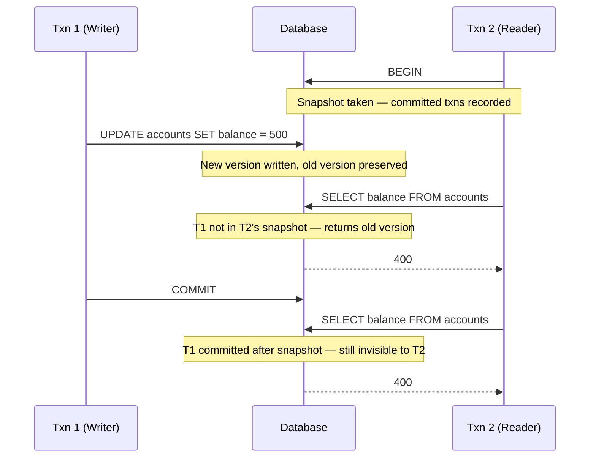

Databases have to deal with many clients reading and writing simultaneously. The naive solution is locks: a writer acquires an exclusive lock on a row, and readers wait until it is released.

This works correctly but kills read throughput under contention. A long-running write transaction can block every read that touches the same rows, turning a concurrent system into a queue.

But readers don't actually need to see writes in progress. A read that started before a transaction began has no business seeing its uncommitted data. If we can give readers a stable view of the database as it existed when they started, readers and writers can proceed simultaneously without interfering with each other.

That is the core insight behind **Multi-Version Concurrency Control (MVCC)**.


## The Core Idea

With MVCC, a database never modifies a row in place. Instead, it writes a new version of the row and keeps the old version on disk. Each version is tagged with the transaction that created it.

When a transaction starts, it receives a **snapshot**: a record of which transactions were committed at that moment. The transaction only sees row versions whose creating transaction appears in its snapshot. It ignores versions from transactions that were still in-flight or hadn't started when the snapshot was taken.

The result is that readers see a consistent, frozen view of the database as of their start time, even as writers are creating new versions alongside them.



T2 sees the same data throughout its transaction regardless of what T1 does. Neither transaction waits for the other.

## PostgreSQL

PostgreSQL stores every version of a row as a separate **tuple** in the heap file (if you're curious about how a row gets to the heap in the first place, check out my deep dive on [how PostgreSQL writes a row](/blog/postgres-write-row)). Each tuple carries two fields:

- **`xmin`** - the transaction ID that created this tuple.
- **`xmax`** - the transaction ID that deleted or replaced it. Zero if the tuple is still live.

When a row is updated, PostgreSQL writes a brand-new tuple with a new `xmin`, then sets `xmax` on the old tuple to the updating transaction's ID. Nothing is overwritten. The old tuple stays exactly where it was, visible to any snapshot that predates the update.

A tuple is visible to a transaction if its `xmin` committed before the snapshot was taken, and its `xmax` is either zero or from a transaction that had not committed by the time the snapshot was taken.

You can see this directly with the `pageinspect` extension:

```sql
SELECT lp, t_xmin, t_xmax, t_data
FROM heap_page_items(get_raw_page('accounts', 0));
```

The cost of this approach is that dead tuples accumulate in the heap. Old versions cannot be removed until no active transaction's snapshot predates them. PostgreSQL's **autovacuum** process runs in the background and reclaims those dead tuples once they are no longer visible to any running transaction. Without regular vacuuming, tables bloat and sequential scan performance degrades.

On Amazon RDS and Aurora PostgreSQL, autovacuum runs automatically, but the default settings are not tuned for all workloads. High-write tables often benefit from tighter `autovacuum_vacuum_scale_factor` and `autovacuum_vacuum_threshold` settings, configured per-table via RDS Parameter Groups. 

PostgreSQL transaction IDs are 32-bit integers, giving roughly 2 billion possible values before the counter wraps around. MVCC visibility is computed by comparing transaction IDs using modular arithmetic that treats the ID space as a circle - any ID within 2 billion behind the current one is considered "in the past," and any ID within 2 billion ahead is considered "in the future." If a live tuple's `xmin` is more than 2 billion transactions old, that arithmetic flips it to "in the future," making the row invisible to every transaction. Rows silently disappear. That is **transaction ID wraparound**.

Autovacuum prevents this by **freezing** old tuples before they approach the wraparound horizon. Freezing replaces `xmin` with a special marker (`FrozenTransactionId`) that is always treated as in the past, removing the tuple from the ID comparison entirely. PostgreSQL starts warning in the server logs when you are within 40 million transactions of the limit, and shuts down entirely - refusing all writes - at 3 million, to force a manual vacuum before data loss occurs.

The `MaximumUsedTransactionIDs` CloudWatch metric tracks how close the oldest un-frozen transaction ID is to the wraparound limit. Wraparound is almost always caused by autovacuum being blocked - by a long-running transaction, or by settings that cannot keep up with write volume.

## CockroachDB

CockroachDB is a distributed SQL database built on a replicated key-value store (using a [Multi-Raft architecture](/blog/multi-raft-architecture)). It implements MVCC at the storage layer, but with an important difference: row versions are keyed by **(key, timestamp)** rather than (key, transaction ID).

Instead of integer transaction IDs, CockroachDB uses **Hybrid Logical Clocks (HLC)**. An HLC combines a physical wall clock with a logical counter. When a node receives a message timestamped ahead of its own clock, it advances its logical counter to match. This gives every event a globally comparable timestamp while tolerating the fact that clocks across machines are never perfectly synchronized.

The maximum clock offset between nodes is bounded at 500ms by default. If a node's clock drifts past that threshold, CockroachDB refuses writes rather than risk violating timestamp ordering.

When a reader needs a row at a given timestamp, it fetches the most recent version with a timestamp at or below the read timestamp. Writers create new versions at their commit timestamp. **Garbage collection** periodically removes versions older than the GC interval (25 hours by default), once no running transaction could possibly need them.

The distributed nature of MVCC is what makes clock discipline so important here. A single-node database can trivially order all transactions by an incrementing counter. A distributed system has to work much harder to establish a consistent ordering that every node agrees on.

## MySQL InnoDB

InnoDB takes the opposite approach to storing old versions. The main table always holds the current version of a row. Old versions live in **undo logs** - records that describe how to reverse each change.

When a reader needs to see an older version of a row, InnoDB walks backward through the undo log, applying undo records one by one until it reconstructs the row as it existed at the reader's snapshot time.

The tradeoff is the inverse of PostgreSQL's. The main table stays compact because old versions are not accumulating there. But reading an old version is more work: InnoDB has to apply potentially many undo records to reconstruct it. A long-running read transaction against a heavily written table can be noticeably slower than the same query against a quiet one.

The **purge thread** is InnoDB's equivalent of autovacuum. It discards undo log records that no active transaction needs anymore. A long-running transaction that holds a snapshot open blocks purging, causing the undo log to grow. On older MySQL configurations, this means `ibdata1` (the system tablespace) grows without bound and cannot be reclaimed without a full dump and reload.

## The Cost: Bloat and Vacuum

Every MVCC implementation faces the same tension: old row versions must be retained until no running transaction can possibly need them. The longer a transaction runs, the more old versions accumulate.

The cleanup mechanisms differ, but the failure mode is identical across all three databases. A long-running transaction holds a snapshot open, blocking cleanup, and storage or performance degrades.

In PostgreSQL, this is **table bloat**. Autovacuum cannot reclaim dead tuples while any transaction holds a snapshot older than those tuples. A transaction left open by accident - a `BEGIN` in a psql session, a connection pool holding an idle transaction - can silently prevent vacuuming on busy tables.

In CockroachDB, the GC interval controls how long old MVCC versions stick around. A cluster under sustained write load with a long GC interval accumulates more versions and shows slower range scans as the storage engine has more versions to skip over.

In InnoDB, the same open transaction that prevents undo log purging also causes the storage footprint to grow in a way that is painful to recover from. InnoDB does not compact `ibdata1` in place.

The common thread: monitor for long-running transactions. In PostgreSQL, `pg_stat_activity` shows any transaction older than a threshold. In CockroachDB, the Admin UI surfaces long-running transactions. In MySQL, `SHOW ENGINE INNODB STATUS` includes undo log size and the age of the oldest active transaction. Catching a runaway transaction early costs far less than the recovery work it prevents.

## Conclusion

MVCC is what makes practical database concurrency possible. By keeping multiple versions of rows and giving each transaction a consistent snapshot, databases let readers and writers run simultaneously without blocking each other.

The tradeoff is storage and cleanup complexity. Dead versions accumulate and must eventually be reclaimed, and cleanup can always be disrupted by long-running transactions. Every MVCC database has a cleanup mechanism, and every cleanup mechanism has a way to get stuck. Understanding that is what separates diagnosing a vacuum issue from being surprised by one.

## Further Reading

- [PostgreSQL MVCC documentation](https://www.postgresql.org/docs/current/mvcc-intro.html)
- [The Internals of PostgreSQL - Chapter 5](https://www.interdb.jp/pg/pgsql05.html) - deep dive on PostgreSQL's MVCC implementation
- [CockroachDB MVCC](https://www.cockroachlabs.com/blog/mvcc-garbage-collection/)
- [Designing Data-Intensive Applications](https://dataintensive.net/) by Martin Kleppmann - Chapter 7 covers transactions and snapshot isolation

<div class="quiz-widget">
  <div class="quiz-header">
    <svg xmlns="http://www.w3.org/2000/svg" width="22" height="22" viewBox="0 0 24 24" fill="none" stroke="currentColor" stroke-width="2" stroke-linecap="round" stroke-linejoin="round"><path d="M12 22c5.523 0 10-4.477 10-10S17.523 2 12 2 2 6.477 2 12s4.477 10 10 10z"></path><path d="M9.09 9a3 3 0 0 1 5.83 1c0 2-3 3-3 3"></path><line x1="12" y1="17" x2="12.01" y2="17"></line></svg>
    Knowledge Check <span class="quiz-progress"></span>
  </div>

  <div class="quiz-question-block" data-correct="B">
    <div class="quiz-question">What is the primary problem MVCC solves that traditional locking does not?</div>
    <div class="quiz-options">
      <div class="quiz-option" data-letter="A"><div>Data corruption during crashes.</div></div>
      <div class="quiz-option" data-letter="B"><div>Readers being blocked by writers (and vice versa).</div></div>
      <div class="quiz-option" data-letter="C"><div>Hard drive failure.</div></div>
      <div class="quiz-option" data-letter="D"><div>Network latency in distributed clusters.</div></div>
    </div>
    <div class="quiz-success-msg"><strong>Correct! 🎉</strong> By keeping old versions around, MVCC allows readers and writers to proceed simultaneously without interfering with each other.</div>
    <div class="quiz-error-msg"><strong>Not quite.</strong> The correct answer is <strong>B</strong>. While DBs have mechanisms for crashes (like <a href="/blog/write-ahead-logging">WAL</a>), MVCC specifically addresses concurrent access without locks.</div>
  </div>

  <div class="quiz-question-block" data-correct="C">
    <div class="quiz-question">In PostgreSQL, what happens to an old row version when a writer updates it?</div>
    <div class="quiz-options">
      <div class="quiz-option" data-letter="A"><div>It is immediately deleted to save space.</div></div>
      <div class="quiz-option" data-letter="B"><div>It is moved to an "undo log" outside the main table.</div></div>
      <div class="quiz-option" data-letter="C"><div>It stays in the heap file, but its xmax is set to the writer's transaction ID.</div></div>
      <div class="quiz-option" data-letter="D"><div>It is overwritten by the new data.</div></div>
    </div>
    <div class="quiz-success-msg"><strong>Correct! 🎉</strong> PostgreSQL writes a brand-new tuple for the update and simply updates the old tuple's xmax. The old tuple stays exactly where it was.</div>
    <div class="quiz-error-msg"><strong>Not quite.</strong> The correct answer is <strong>C</strong>. B describes InnoDB's approach, and A/D would destroy data needed by active readers.</div>
  </div>

  <div class="quiz-question-block" data-correct="C">
    <div class="quiz-question">Which database uses "Undo Logs" to reconstruct older versions of rows rather than storing multiple versions directly in the main table?</div>
    <div class="quiz-options">
      <div class="quiz-option" data-letter="A"><div>PostgreSQL</div></div>
      <div class="quiz-option" data-letter="B"><div>CockroachDB</div></div>
      <div class="quiz-option" data-letter="C"><div>MySQL (InnoDB)</div></div>
      <div class="quiz-option" data-letter="D"><div>SQLite</div></div>
    </div>
    <div class="quiz-success-msg"><strong>Correct! 🎉</strong> InnoDB keeps the main table compact by storing the current version there, and uses undo logs to rebuild older versions for active snapshots.</div>
    <div class="quiz-error-msg"><strong>Not quite.</strong> The correct answer is <strong>C</strong>. PostgreSQL stores old versions directly in the main heap file.</div>
  </div>

  <div class="quiz-question-block" data-correct="B">
    <div class="quiz-question">What is the main risk of "Transaction ID Wraparound" in PostgreSQL?</div>
    <div class="quiz-options">
      <div class="quiz-option" data-letter="A"><div>The database becomes too fast for the CPU.</div></div>
      <div class="quiz-option" data-letter="B"><div>Older rows can silently "disappear" or become invisible.</div></div>
      <div class="quiz-option" data-letter="C"><div>The database automatically deletes the newest transactions.</div></div>
      <div class="quiz-option" data-letter="D"><div>The hard drive is physically damaged.</div></div>
    </div>
    <div class="quiz-success-msg"><strong>Correct! 🎉</strong> If old tuples aren't frozen by autovacuum before the 2 billion transaction threshold is reached, modular arithmetic flips their status to "in the future," rendering them permanently invisible.</div>
    <div class="quiz-error-msg"><strong>Not quite.</strong> The correct answer is <strong>B</strong>. It causes catastrophic silent data loss because old data suddenly appears to be from the future.</div>
  </div>

  <div class="quiz-question-block" data-correct="B">
    <div class="quiz-question">Which mechanism is used by CockroachDB to order transactions across different machines?</div>
    <div class="quiz-options">
      <div class="quiz-option" data-letter="A"><div>Sequential Integers</div></div>
      <div class="quiz-option" data-letter="B"><div>Hybrid Logical Clocks (HLC)</div></div>
      <div class="quiz-option" data-letter="C"><div>Random Number Generators</div></div>
      <div class="quiz-option" data-letter="D"><div>Atomic Wall Clocks only</div></div>
    </div>
    <div class="quiz-success-msg"><strong>Correct! 🎉</strong> CockroachDB uses Hybrid Logical Clocks, combining physical wall clocks with logical counters to establish a consistent ordering while tolerating slight clock drift.</div>
    <div class="quiz-error-msg"><strong>Not quite.</strong> The correct answer is <strong>B</strong>. Relying purely on wall clocks (D) is dangerous due to drift, and sequential integers (A) are impractical in a decentralized distributed system.</div>
  </div>

  <div class="quiz-footer">
    <button class="quiz-next-btn">Next Question →</button>
  </div>
  
  <div class="quiz-results">
    <h4>Quiz Complete!</h4>
    <p>You scored <strong class="quiz-score">0</strong> out of <strong>5</strong>.</p>
  </div>
</div>
