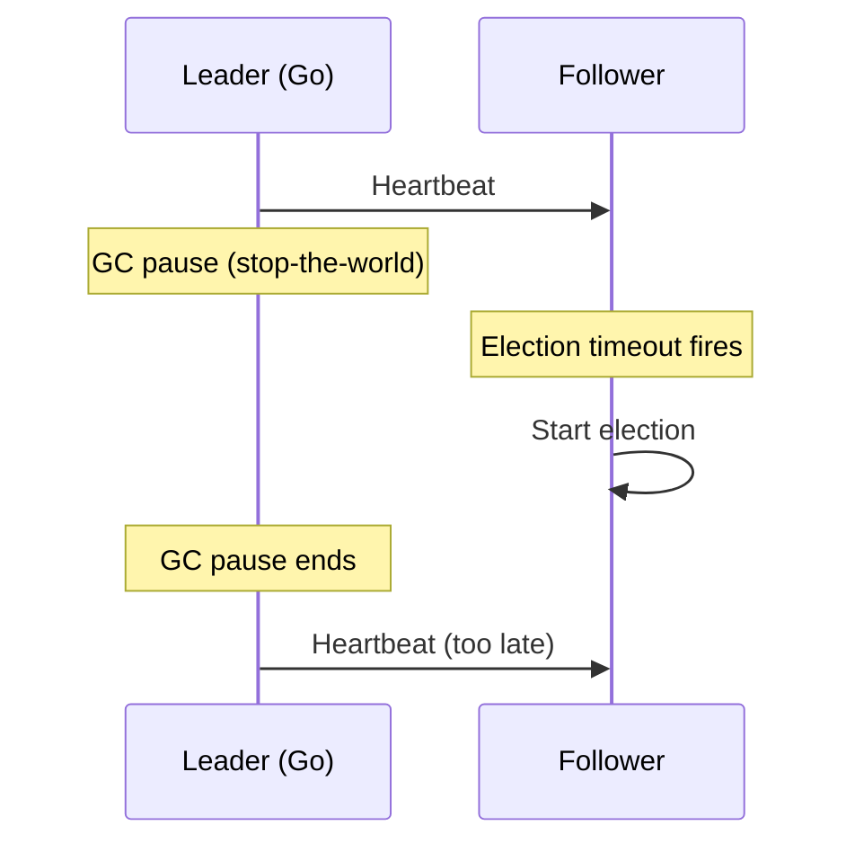
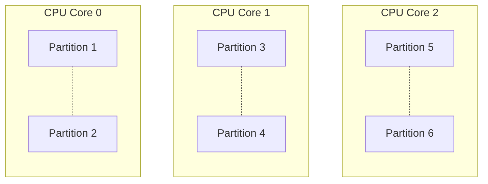
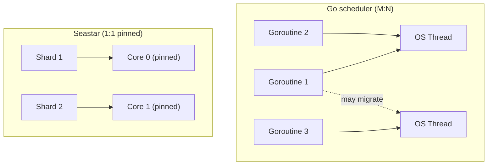

The Raft algorithm doesn't care what language you implement it in. Leader election, log replication, quorum commits, all of it is defined in terms of messages and state transitions, not goroutines or threads. But the runtime underneath shapes which implementation strategies are even possible. [CockroachDB, TiKV, and Redpanda all implement Multi-Raft](/blog/multi-raft-architecture), but they made different choices about how to manage thousands of Raft groups concurrently. Those choices trace back directly to their runtimes.

## GC pauses look like dead leaders

In a Raft cluster, followers expect *heartbeats from the leader* on a regular interval, typically every 100-200ms. If a follower doesn't receive a heartbeat within the election timeout, typically 1-5 seconds, it assumes the leader is dead and starts an election.

A *garbage collector pause* can look exactly like a dead leader. If the Go runtime pauses all goroutines for 300ms to scan memory, any followers waiting on a heartbeat from that node may time out and trigger an election. The leader isn't dead. It's just frozen. But from the follower's perspective, there is no difference.

Go's GC targets sub-100-microsecond *stop-the-world pauses* in typical workloads. But "typical" is doing a lot of work in that sentence. Under memory pressure, when large heaps need scanning, or during sudden allocation spikes, pauses can stretch longer. *CockroachDB* publishes GC tuning guidance (`GOGC`, `GOMEMLIMIT`) specifically to reduce pressure in high-throughput workloads.

Go 1.26 shipped a reworked garbage collector called **Green Tea**, which reduces GC overhead by 10-40% and became the default with no configuration required. It was available as an opt-in experiment in Go 1.25. CockroachDB is currently on Go 1.25.5, so the problem described here is still present for them.

Rust and C++ have no garbage collector. A process written in either language is never paused for memory management. This makes consensus timing more predictable, particularly at the tail: p99 and p999 latency are where GC shows up, because you're measuring the worst cases.

## Thread-per-core requires owning the scheduler

*Redpanda* pins each Kafka partition, and its Raft group, to a specific CPU core. No other core ever touches that partition's data. There is nothing to lock if only one thread ever reads and writes it.

This only works if you control which OS thread runs on which core, and that it *stays* there. Redpanda's [Seastar](https://seastar.io) framework achieves this by:
* Creating exactly one thread per CPU core at startup
* Pinning each thread to its core via `pthread_setaffinity_np`
    * A Linux call that overrides the OS scheduler. Without it, the kernel moves threads between cores freely. With it, thread 0 stays on core 0, always.
* Never blocking. All I/O is async via `io_uring` or `epoll`
    * Linux kernel mechanisms. Instead of waiting for a network read to complete, the thread registers interest and keeps working. The kernel signals when data is ready. A blocked thread would waste the core it's pinned to.
* Using lock-free queues for the rare cases where cross-core communication is needed

This architecture assumes direct access to physical CPU cores. On most virtualized EC2 instance types, the hypervisor maps virtual CPUs to physical cores and may reschedule them outside your control. Redpanda recommends bare metal instances (such as `c5.metal` or `m7i.metal`) to get the hardware guarantees that thread-per-core depends on.

You **cannot replicate this in Go**. The Go scheduler uses an **M:N model: it multiplexes goroutines (M) onto OS threads (N)** and moves them **between threads freely** to keep all threads busy. A goroutine that starts executing on core 0 may resume on core 3 after the next scheduling point. `runtime.LockOSThread()` pins a goroutine to one OS thread, but that OS thread is still scheduled by the kernel across all available cores. There is no stable "this goroutine always runs on this physical core" guarantee.

Even if you forced Go goroutines onto fixed OS threads, the GC would still need to stop all goroutines, including your pinned ones, to scan the heap.

Redpanda isn't the only one. Datadog's [Monocle](https://www.datadoghq.com/blog/engineering/rust-timeseries-engine/), their Rust-based timeseries engine, uses the same model: one storage shard per CPU core, each running on its own single-threaded Tokio runtime with no cross-shard locking. Each shard owns its private memtable and never touches another shard's data.

[AWS Managed Streaming for Apache Kafka (MSK)](https://aws.amazon.com/msk/) runs standard Apache Kafka on the JVM. It inherits Kafka's GC characteristics rather than Redpanda's thread-per-core model. If tail latency is a primary concern, that runtime difference is worth factoring into the choice.

## Rust: no GC, memory safety at compile time

[TiKV drives hundreds of thousands of Raft state machines through a single event loop](https://tikv.org/deep-dive/scalability/multi-raft/), passing data between threads without locks.

TiKV uses Rust instead of C++ not for performance, but for what the type system enforces around thread safety. The Rust Book describes it this way:

> Once you get your code to compile, you can rest assured that it will happily run on multiple threads without the kinds of hard-to-track-down bugs common in other languages.

([Extensible Concurrency with Send and Sync](https://doc.rust-lang.org/book/ch16-04-extensible-concurrency-sync-and-send.html))

For a Raft implementation, a data race in the consensus state machine is a split-brain bug: two nodes both believing they are the leader, committing conflicting entries. It will not show up in a test environment. Rust makes an entire class of those bugs impossible to ship.

## When does the runtime become the bottleneck?

At small scale, none of this matters. A 3-node cluster handling thousands of writes per second will run fine in any language. The runtime trade-offs surface under specific conditions:

* **High range or partition counts.** Managing 50,000 Raft groups means 50,000 concurrent state machines. GC heap pressure scales with object count. Scheduling overhead scales with goroutine count.
* **Tight tail latency requirements.** p99 and p999 latency is where GC pauses appear. At the 99.9th percentile you are measuring the worst cases, which is exactly when a GC cycle is most likely to run.
* **High write fanout.** Each write to a 5-replica range requires 4 `AppendEntries` RPCs. At 100,000 ranges with frequent writes, the cost of managing all that concurrent I/O compounds. How the runtime handles that concurrency determines whether it stays manageable.

Most of the time you won't hit these limits. Go is a fine choice, and CockroachDB has scaled it further than most systems ever need to go. But when things do break down, the runtime is usually the last thing you look at. It probably should have been earlier.

## Further reading

**Go GC**
- [Go GC: Prioritizing low latency and simplicity](https://go.dev/blog/go15gc) - Go blog (concurrent tri-color mark-sweep collector introduced in Go 1.5)
- [The Green Tea Garbage Collector](https://go.dev/blog/greenteagc) - 10-40% GC overhead reduction, default in Go 1.26
- [How to optimize garbage collection in Go](https://www.cockroachlabs.com/blog/how-to-optimize-garbage-collection-in-go/) - Cockroach Labs

**Go scheduler**
- [Why goroutines instead of threads?](https://go.dev/doc/faq#goroutines) - Go FAQ (M:N scheduling model)

**Seastar / thread-per-core**
- [Seastar](https://seastar.io) - the C++ framework behind Redpanda's thread-per-core architecture

**Rust concurrency model**
- [Extensible Concurrency with Send and Sync](https://doc.rust-lang.org/book/ch16-04-extensible-concurrency-sync-and-send.html) - The Rust Programming Language book
