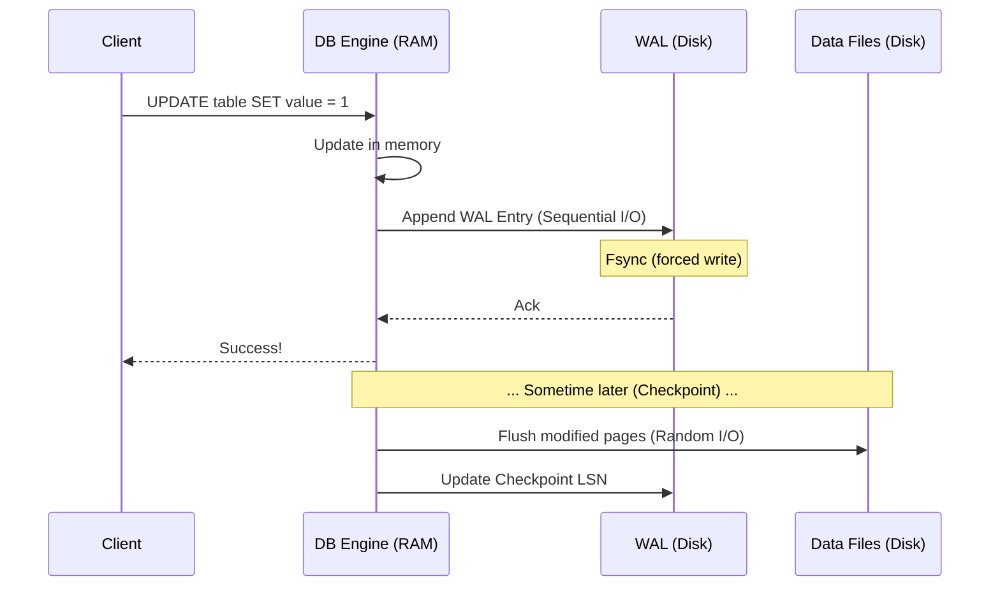

I've been thinking a lot about the internals of deeply distributed, highly resilient systems lately. In my [previous post on Multi-Raft Architecture](/blog/multi-raft-architecture), I wrote about how distributed databases achieve consensus across thousands of nodes. But before a node can agree with its peers, it needs to ensure its *own* data is secure. Before a database cluster can survive a network partition, a single node must survive having its power cord pulled out.

Almost every serious data system, from massive streaming architectures detailed by [Netflix](https://netflixtechblog.com/building-a-resilient-data-platform-with-write-ahead-log-at-netflix-127b6712359a) to the SQLite file embedded in your phone, solves local durability with the exact same mechanism: **Write-Ahead Logging (WAL)**.

## The Problem WAL Solves

A naive database design writes data directly to disk. If an application updates a customer's balance, the database finds the exact location of that record on the hard drive and overwrites it. 

The problem is that writes are not atomic at the hardware level. If the system crashes mid-write, or if power is lost while the disk is partially through flushing a sector, you get **torn pages** - partial data corruption that leaves your database in an unreadable state. 

To solve this, the database needs a way to make changes safely without destroying the current state if something goes wrong.

The solution is to write a description of the change to an append-only log first, then apply it to the data files asynchronously. If the system crashes, it reads the log on startup to replay the missing changes.

## How It Works

The fundamental rule of Write-Ahead Logging is that the log record must be safely flushed to disk before the database acknowledges the transaction.

Writing to the log is fast because it is append-only. The disk drive doesn't have to seek to find specific rows. It just sequentially writes blocks of data to the end of a file. Sequential I/O is orders of magnitude faster than random I/O, even on modern NVMe drives.

A typical WAL record contains:
1. **What changed** (the payload).
2. **Where it changed** (the specific page or row).
3. A **Log Sequence Number (LSN)** to track its exact position in the log history.

The database periodically performs a **checkpoint**. It flushes all the pending changes from memory into the permanent data files and records the current LSN. Once a checkpoint finishes successfully, any WAL files older than that LSN can be safely deleted or archived, because those changes are now permanently embedded in the main database files.

While the core concept is the same, databases implement WALs differently depending on their architecture. 

## PostgreSQL

In PostgreSQL, the write-ahead logs live in the `pg_wal` directory (formerly `pg_xlog`). Each default file is 16MB of dense, sequential history.

PostgreSQL relies heavily on a massive chunk of RAM called `shared_buffers`. When you write to Postgres, it modifies the page in `shared_buffers` and immediately writes a WAL record. The actual data file isn't touched until a background process called the "checkpointer" wakes up and flushes the dirty buffers to disk.

This setup gives you a lot of control. For absolute safety, keeping `synchronous_commit = on` means Postgres will wait for the WAL to hit the physical disk before telling the app the transaction succeeded. For raw speed at the cost of potentially losing a few milliseconds of data on a hard crash, `synchronous_commit = off` tells Postgres to report success immediately and flush the WAL to disk a split second later.

I always wondered how Amazon RDS for PostgreSQL achieves Point-In-Time Recovery (PITR), allowing you to restore a database to a specific *second*. Under the hood, AWS is just taking a periodic base snapshot and endlessly streaming the `pg_wal` files to an S3 bucket. When requesting a restore, RDS instantiates the snapshot and rapidly replays the archived WAL files precisely up to the target timestamp.

## SQLite

SQLite traditionally used a "rollback journal", where it would copy the *old* data to a separate file, write the *new* data to the main file, and delete the journal on success. If a crash occurred, it would use the old data to roll back the corrupted changes.

Modern SQLite offers a WAL mode (`pragma journal_mode=WAL;`), which flips this process around to match the append-only paradigm of larger databases. 

WAL mode also improves concurrency in SQLite. Because writers only append to the WAL and readers can read from the main database file (checking the WAL for recent changes), readers no longer block writers, and writers no longer block readers.

## RocksDB

RocksDB, and the systems built on it like CockroachDB's storage engine Pebble, uses a **Log-Structured Merge (LSM) tree** instead of traditional B-trees.

When writing to RocksDB, the data is stored in an in-memory structure called a **MemTable**. Maintaining a massive, sorted tree structure on disk during active writes is way too slow. 

Because RAM is volatile, RocksDB appends every write to a Write-Ahead Log before updating the MemTable. When the MemTable fills up, it is flushed to disk as an immutable **SSTable (Sorted String Table)**. Once the SSTable is safely on disk, the corresponding WAL is discarded. The WAL only exists to protect data until it is safely flushed from memory.

## etcd

For a distributed key-value store like etcd, the log is used for more than local crash recovery. 

Etcd uses the Raft consensus algorithm. In Raft, the log is the authoritative state of the cluster.

When a leader receives a write, it appends the entry to its WAL and proposes it to the followers. The leader only commits the write after a quorum (majority) of nodes have flushed the entry to their own WALs.

The WAL acts as the distributed consensus mechanism. Because the log is durable across multiple independent machines, the cluster can maintain consensus and tolerate node failures.

## What They Have In Common

Despite the different architectures, all these systems rely on Write-Ahead Logging for the same core reasons:

- **Sequential I/O:** Appending data is significantly faster than performing random I/O to overwrite existing pages.
- **Deferred work:** The database can acknowledge a write immediately after the sequential WAL write, deferring the expensive updates to B-trees or LSM trees to background processes.
- **Checkpointing:** Every implementation requires a way to flush in-memory state and truncate the log, preventing it from consuming the entire disk or causing slow recovery times.

The core durability mechanism across all these storage systems remains the same: an append-only log.

## Further Reading

- [PostgreSQL WAL Documentation](https://www.postgresql.org/docs/current/wal-intro.html)
- [How SQLite WAL Works](https://www.sqlite.org/wal.html)
- [RocksDB Write-Ahead Log](https://github.com/facebook/rocksdb/wiki/Write-Ahead-Log-%28WAL%29)
- [Building a resilient data platform with WAL at Netflix](https://netflixtechblog.com/building-a-resilient-data-platform-with-write-ahead-log-at-netflix-127b6712359a)
- *Designing Data-Intensive Applications* by Martin Kleppmann - Chapter 3 provides an incredible deep dive into storage engines and WAL.
